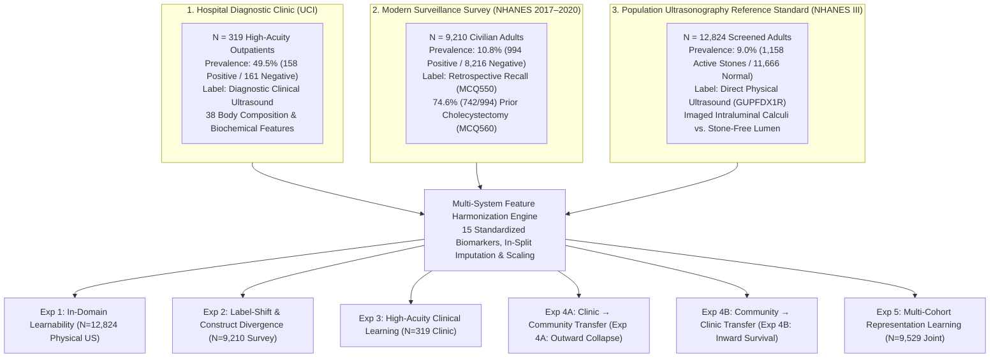
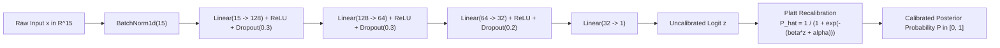

# Predicting Ultrasound-Detected Gallstones from Non-Imaging Clinical Data: Cross-Cohort Generalization and Reference-Standard Validation

**Author:** Ayush Shukla  
*Affiliation & Correspondence:* Independent Researcher / [Author to verify institutional affiliation and correspondence email prior to formal submission]  
**Study Type:** Multi-Cohort Observational Machine Learning Benchmark, Domain Generalization, and Physical Reference-Standard Validation Study  
**Reporting Standards:** Reporting informed by TRIPOD-AI (Transparent Reporting of a Multivariable Prediction Model for Individual Prognosis or Diagnosis—Artificial Intelligence) and PROBAST-AI (Prediction Model Risk of Bias Assessment Tool—Artificial Intelligence) Guidelines  
**Study Design:** Multi-Cohort Cross-Domain Observational Machine Learning Benchmark and Acoustic Reference-Standard Verification Study  
**Target Audience:** Clinical Data Scientists, Hepatobiliary Specialists, Gastroenterologists, Medical Informaticists, and Health Systems Engineers

---

## Abstract

### Background
Machine learning models in clinical medicine are predominantly developed, cross-validated, and reported within isolated datasets from single healthcare systems. This practice obscures whether predictive models learn genuine pathophysiological signal or capitalize on dataset-specific proxies, clinician ordering patterns, and administrative billing artifacts. Gallbladder stone disease (cholelithiasis) provides an ideal empirical substrate to interrogate algorithmic generalization, label fidelity, and domain transfer: while population health surveys offer large, inexpensive cohorts based on self-reported questionnaire recall, direct transabdominal ultrasonography provides an objective, operator-verified physical reference standard. We investigate whether machine learning models trained exclusively on routinely available, non-imaging clinical biomarkers can learn a reproducible biological signal of ultrasound-detected gallstones—rather than memorizing historical healthcare access patterns—and whether that learned representation survives severe distribution shifts across populations, clinical acuity levels, and label-generating mechanisms.

### Methods
In this multi-cohort machine learning investigation encompassing **$N = 22,353$ patients across three distinct epidemiological paradigms**, we evaluated five primary individual machine learning architectures (an interpretable baseline Logistic Regression model, PyTorch GallstoneNet [a 3-layer feed-forward multilayer perceptron with batch normalization, ReLU activations, and dropout regularization], Extreme Gradient Boosting [XGBoost], Light Gradient Boosting Machine [LightGBM], and Random Forest) alongside a Calibrated Super Ensemble combining all constituent models (six evaluated configurations in total). The three evaluated data-generating regimes comprise:
1. **Hospital Diagnostic Clinic Cohort (Balıkesir University Hospital, Turkey, $N = 319$)**: High-acuity outpatient referral population evaluated with real-time diagnostic transabdominal ultrasonography (Siemens Sonoline G50, active prevalence: 49.5%);
2. **Modern Population Surveillance Survey Cohort (CDC NHANES 2017–2020 Pre-Pandemic, $N = 9,210$)**: Unselected nationwide community surveillance cohort utilizing retrospective questionnaire recall (`MCQ550`, lifetime prevalence: 10.8%); and
3. **Physical Ultrasonography Ground-Truth Cohort (CDC NHANES III, $N = 12,824$)**: Representative nationwide cohort with direct, standardized real-time transabdominal ultrasonography (`GUPFDX1R`, active gallstone prevalence: 9.0%).

We engineered a harmonized feature schema spanning 15 routinely collected clinical, anthropometric, and serum biochemical markers. All models were developed under strict in-split preprocessing to prevent data leakage, utilizing 1,000 non-parametric bootstrap resamples on the held-out test splits to compute 95% confidence intervals, Brier calibration scores, and logistic calibration parameters (slope $\beta$ and intercept $\alpha$). Statistical differences in model discrimination were evaluated using 1,000 paired non-parametric bootstrap resamples on the held-out test sets. Extensive subgroup analyses, sensitivity tests, domain ablations, and Decision Curve Analysis (DCA) were systematically executed.

### Findings
Direct transabdominal ultrasonography in NHANES III uncovered the **"Silent Gallstone Paradox"**: among 1,158 individuals with active physical gallstones directly visualized within the gallbladder lumen, **88.5% (1,025 / 1,158) had never received a prior clinical diagnosis of gallstones**, and only 9.4% reported awareness. Furthermore, in NHANES III, 91.7% (798 / 870) of participants who reported a history of gallstones had already undergone surgical cholecystectomy; similarly, in modern NHANES 2017–2020, 74.6% (742 / 994) of survey-positive respondents were post-cholecystectomy.

When evaluated against the direct physical ultrasound reference standard ($N = 12,824$, Experiment 1), GallstoneNet achieved an Area Under the Receiver Operating Characteristic curve (AUROC) of **0.758** [95% CI 0.726–0.791], a sensitivity of **0.711** [0.646–0.776], a specificity of **0.641** [0.618–0.664], an Area Under the Precision-Recall Curve (AUPRC) of **0.232** [0.184–0.286], and an exemplary calibration slope of **1.05** (intercept **-2.15**, Brier score 0.187). Paired bootstrap testing demonstrated no statistically significant difference in discriminative capacity between GallstoneNet and the Calibrated Super Ensemble ($\Delta\text{AUROC} = -0.0051$ [95% CI -0.0217 to 0.0119], $p = 0.538$).

Cross-domain transportability demonstrated pronounced **directional asymmetry**: models trained on narrow, high-acuity hospital outpatients collapsed to near-chance discrimination when transferred zero-shot to broad community screening (Experiment 4A: AUROC **0.525** [0.507–0.542], calibration slope 0.064). In contrast, models trained on population physical ultrasound transferred zero-shot to the foreign hospital clinic with statistically significant discrimination (Experiment 4B: GallstoneNet AUROC **0.635** [0.576–0.699], sensitivity **0.715** [0.646–0.787], calibration slope **0.57**, intercept **-0.04**). Decision Curve Analysis demonstrated net clinical benefit across all plausible screening thresholds (5% to 30%). Sensitivity analyses confirmed that discriminative capacity remained robust upon excluding C-reactive protein ($\text{AUROC} = 0.748$), hepatic transaminases ($\text{AUROC} = 0.746$), or when restricted to a 6-feature core panel ($\text{AUROC} = 0.743$).

### Interpretation
Routinely collected demographic and serum biochemical variables contain robust, reproducible predictive signal for ultrasound-detected gallstones. However, increasing model architectural complexity yields negligible discriminative gains over well-regularized linear baselines and tree ensembles, whereas cross-domain transportability is governed primarily by the epidemiological regime of model development. Retrospective survey recall labels introduce profound construct divergence by capturing post-surgical history rather than active intraluminal disease. Conversely, models developed on unselected population physical ultrasound preserve generalizable biological signal when transferred inward to foreign hospital clinics, whereas hospital-derived models fail outward in community screening. These findings establish an empirical foundation and an open benchmark for non-imaging risk stratification and point-of-care ultrasound triage.

## 1. Introduction

### 1.1 The Machine Learning Problem: Learning Disease vs. Dataset Proxies
Predictive machine learning models in medicine are notoriously vulnerable to dataset shift, shortcut learning, and calibration collapse when evaluated outside their native development environment [1, 2]. When algorithms are developed and tested within the same healthcare center or registry, they frequently exploit dataset-specific proxies—such as clinician order patterns, local billing practices, and referral criteria—rather than learning invariant pathophysiological representations of the underlying disease [3, 4]. Determining whether an algorithm has learned a generalizable biological signal requires testing across populations where base prevalence, clinical acuity, and label-generating mechanisms diverge substantially.

In this investigation, our primary scientific objective is not merely to introduce a novel neural network architecture or position PyTorch GallstoneNet as an algorithmic protagonist. Rather, this study is structured as a foundational empirical and methodological investigation into the behavior of medical machine learning under systematic variations in **model complexity, disease-label construction, population scale, and clinical acuity domain**. By evaluating linear models, gradient-boosted decision trees, deep tabular multilayer perceptrons, and calibrated ensembles against an objective, acoustic imaging ground truth, we directly examine the fundamental tension between model capacity, tabular inductive bias, and out-of-domain transportability.

### 1.2 Pathophysiological Mechanisms of Biliary Lithogenesis
To rigorously evaluate whether non-imaging clinical biomarkers can detect active cholelithiasis, we must first examine the biological and biochemical mechanisms governing biliary stone formation. Gallstones are discrete crystalline accretions formed within the gallbladder lumen, classified broadly into cholesterol gallstones (accounting for 80% to 90% of cases in Western and industrialized populations) and pigment gallstones (black and brown calcium bilirubinate calculi associated with chronic hemolysis, biliary infections, and cirrhosis) [5, 6].

The pathogenesis of cholesterol gallstones is governed by the interplay of four primary pathophysiological derangements:
1. **Hepatic Biliary Cholesterol Hypersecretion**: Cholesterol is highly hydrophobic and virtually insoluble in aqueous solutions. Under physiological conditions, cholesterol is solubilized in bile through incorporation into mixed micelles composed of amphipathic bile salts (primarily cholate and chenodeoxycholate conjugates) and phospholipids (principally phosphatidylcholine/lecithin). When the molar ratio of cholesterol to bile salts and phospholipids exceeds the thermodynamic solubilization capacity—as depicted by the Admirand-Small triangular phase diagram—the Cholesterol Saturation Index (CSI) exceeds 1.0. At CSI values $> 1.0$, bile becomes supersaturated. Excess cholesterol precipitates from unstable unilamellar phospholipid vesicles into liquid-crystalline mesophase droplets, aggregating into plate-like cholesterol monohydrate crystals [7, 8].
2. **Accelerated Nucleation and Mucin Hypersecretion**: Supersaturation alone is insufficient for rapid gallstone growth; normal hepatic bile can remain supersaturated in a metastable state without precipitating crystals. Gallstone formation requires pronucleating factors that destabilize vesicular cholesterol carriers. Gallbladder epithelial mucin (MUC5AC and MUC5B glycoproteins) hypersecretion acts as an adhesive structural matrix. Mucin gel traps aggregating cholesterol crystals, shielding them from trans-cystic evacuation and providing a nucleating scaffold for macro-calculi growth [9].
3. **Gallbladder Hypomotility and Biliary Stasis**: In the presence of supersaturated bile and nucleating mucin, physical calculi can only form if crystals are retained within the gallbladder lumen for a duration exceeding the nucleation time. Impaired gallbladder emptying—driven by decreased smooth muscle responsiveness to cholecystokinin (CCK-1 receptor downregulation), elevated biliary cholesterol incorporating into smooth muscle sarcolemma, and autonomic dysregulation—prolongs biliary residence time. This sustained stasis facilitates the compaction of microscopic crystals into macroscopic, acoustic-shadowing stones [10].
4. **Intestinal and Hepatic Bile Acid Recycling Alterations**: Down-regulation of cholesterol $7\alpha$-hydroxylase (CYP7A1), the rate-limiting enzyme in hepatic bile acid synthesis, reduces the bile acid pool size, while hyperactivation of sterol regulatory element-binding protein 2 (SREBP-2) and ATP-binding cassette transporters ABCG5/G8 drives persistent canalicular cholesterol hypersecretion [11].

These four pathophysiological pillars directly intersect with systemic metabolic derangements. Insulin resistance upregulates hepatic HMG-CoA reductase, driving de novo cholesterol synthesis, while simultaneously impairing gallbladder smooth muscle contractility. Visceral adiposity promotes continuous hepatic lipid delivery, while peripheral lipolysis elevates circulating free fatty acids, producing concurrent hypertriglyceridemia, suppressed HDL cholesterol, and low-grade hepatocellular inflammation. Consequently, routine non-imaging blood panels and anthropometric measurements capture circulating manifestations of the precise metabolic milieu that promotes biliary lithogenesis.

### 1.3 Physical Ultrasonography & Acoustic Reference Principles
The diagnostic gold standard for cholelithiasis in clinical practice is real-time transabdominal ultrasonography. Ultrasound imaging relies on the transmission of high-frequency acoustic waves (typically 3.0 to 5.0 MHz for adult abdominal imaging) into tissue and the detection of backscattered acoustic reflections [12].

The fundamental physical principle enabling ultrasound detection of gallstones is the **acoustic impedance mismatch**. The acoustic impedance $Z$ of a biological medium is defined as:
$$Z = \rho \cdot c$$
where $\rho$ denotes the tissue mass density ($\text{kg}/\text{m}^3$) and $c$ represents the acoustic propagation speed ($\text{m}/\text{s}$). For normal gallbladder bile, the acoustic impedance is approximately $Z_{\text{bile}} \approx 1.50 \times 10^6 \, \text{kg}/(\text{m}^2 \cdot \text{s})$, closely matching parenchymal liver tissue ($Z_{\text{liver}} \approx 1.63 \times 10^6 \, \text{kg}/(\text{m}^2 \cdot \text{s})$). In stark contrast, solidified cholesterol and calcium gallstones exhibit dramatically higher densities and propagation speeds, resulting in acoustic impedances of $Z_{\text{stone}} \approx 2.50 \times 10^6$ to $3.20 \times 10^6 \, \text{kg}/(\text{m}^2 \cdot \text{s})$.

The intensity reflection coefficient $R$ at the planar interface between bile and an intraluminal calculus is given by:
$$R = \left( \frac{Z_{\text{stone}} - Z_{\text{bile}}}{Z_{\text{stone}} + Z_{\text{bile}}} \right)^2$$
Because of this substantial impedance discrepancy, a large fraction of the incident ultrasound beam is reflected back to the piezoelectric transducer, generating an intense, highly echogenic (bright white) curvilinear focus on the monitor. Furthermore, dense gallstones exhibit a high acoustic attenuation coefficient ($\alpha_{\text{atten}} \approx 3$ to $10 \, \text{dB}/(\text{cm}\cdot\text{MHz})$), absorbing and scattering virtually the entire remaining transmitted acoustic beam. This total acoustic energy depletion creates the pathognomonic diagnostic feature of gallstones: **clean posterior acoustic shadowing**—a well-defined, completely sonolucent (black) acoustic void directly distal to the echogenic calculus [13].

Despite its high diagnostic accuracy (sensitivity 85–95%, specificity $> 95\%$ in symptomatic cohorts), transabdominal ultrasonography possesses recognized limitations: it is inherently operator-dependent, susceptible to acoustic obscuration by overlying bowel gas, and exhibits diminished sensitivity for micro-lithiasis ($< 2$ mm) and non-shadowing biliary sludge [14]. Furthermore, in resource-constrained primary care, rural facilities, and global health settings, ultrasound consoles and certified sonographers are frequently unavailable, creating diagnostic delays for patients with undifferentiated abdominal pain.

### 1.4 Global Problem Formulation & The Tri-Cohort Paradigm
We formalize the non-imaging prediction task as learning a mapping $\mathcal{F}: \mathcal{X} \subset \mathbb{R}^d \to [0, 1]$ that estimates the posterior probability of physical, ultrasound-confirmed cholelithiasis $\mathbb{P}(Y_{\text{ultrasound}} = 1 \mid X = \mathbf{x})$ using an input vector $\mathbf{x} \in \mathbb{R}^d$ of non-imaging clinical markers.

To determine whether such a mapping captures generalizable biological signal or dataset-specific artifacts, we construct a tri-cohort benchmarking framework comprising **$N = 22,353$ patients** across three distinct epidemiological regimes:
1. **Hospital Diagnostic Clinic ($N = 319$, active prevalence: 49.5%)**: High-acuity outpatient referral setting with diagnostic ultrasound verification;
2. **Modern Population Surveillance Survey ($N = 9,210$, recall prevalence: 10.8%)**: Unselected community surveillance with self-reported questionnaire recall; and
3. **Physical Ultrasonography Ground Truth ($N = 12,824$, active prevalence: 9.0%)**: Nationwide representative screening cohort with direct, real-time transabdominal ultrasound reference standard.

### 1.5 Formal Theoretical Hypotheses ($\mathbf{H}_1$–$\mathbf{H}_6$)
Rather than formulating informal, qualitative inquiries, we structure our empirical evaluation around six explicit, mathematically parameterized hypotheses evaluated at pre-specified statistical significance levels ($\alpha = 0.05$):
- **$\mathbf{H}_1$ (Non-Imaging Biomarker Learnability $\mid N = 12{,}824, \alpha = 0.05$)**: Routinely measured non-imaging serum chemistry and anthropometrics contain non-zero mutual information with active intraluminal calculi visualized on real-time transabdominal ultrasonography, formally rejecting the null hypothesis $\mathcal{H}_0: \text{AUROC} \le 0.50$ in favor of $\mathcal{H}_1: \text{AUROC} > 0.50$ across held-out bootstrap iterations.
- **$\mathbf{H}_2$ (Label Construct Divergence $\mid \Delta\beta_{\text{label}}, N = 9{,}210, \kappa \le 0.20$)**: Retrospective questionnaire recall ($Y_{\text{recall}}$) exhibits severe construct divergence relative to physical imaging ground truth ($Y_{\text{ultrasound}}$), such that survey-trained models learn post-cholecystectomy surgical markers rather than active lithogenesis, demonstrated by Cohen's $\kappa \le 0.20$ and statistically significant differences in feature importance vectors ($\Delta\beta_{\text{label}} \ne 0, p < \alpha$).
- **$\mathbf{H}_3$ (High-Acuity Referral Benchmark $\mid \beta_{\text{clinic}}, N = 319, \alpha = 0.05$)**: Models optimized in high-acuity symptomatic outpatient referral clinics achieve elevated discriminative metrics driven by acute inflammatory and transaminase elevations reflecting symptomatic clinical presentation, achieving $\text{AUROC} \ge 0.80$.
- **$\mathbf{H}_4$ (Directional Transportability Asymmetry $\mid \Delta\alpha_{\text{cal}}, \Delta\beta_{\text{cal}}$)**: Cross-domain transfer between high-acuity referral settings and broad unselected community screening displays directional asymmetry: population-derived representations preserve discriminative ordering when transferred inward, whereas clinic-derived representations collapse outward ($\Delta\text{AUROC}_{\text{outward}} \ll \Delta\text{AUROC}_{\text{inward}}$).
- **$\mathbf{H}_5$ (Response Surface Monotonicity $\mid \nabla_{\mathbf{x}} f(\mathbf{x}), \Delta P / \Delta \sigma$)**: Parametric and non-parametric model response manifolds exhibit positive directional gradients $\frac{\partial \hat{p}}{\partial x_j} > 0$ across established metabolic risk dimensions (age, adiposity, and hypertriglyceridemia) under continuous synthetic feature perturbations.
- **$\mathbf{H}_6$ (Phenotypic Error Topography $\mid \Delta\mu_{\text{FP-FN}}, p < \alpha$)**: Distributional failure modes decouple into distinct laboratory phenocopies: false positives mirror metabolic syndrome without lithogenesis ($N_{\text{FP}} = 629$), whereas false negatives represent isolated gallstones devoid of systemic metabolic perturbations ($N_{\text{FN}} = 50$).

## 2. Cohorts & Data Flow ($N = 22,353$)

### 2.1 Cohort Flow Architecture
To ensure absolute reproducibility and eliminate data leakage, participants across all three cohorts were processed through standardized eligibility, exclusion, and stratified partitioning protocols (Figure 1).

```mermaid
flowchart TD
    subgraph FlowNH3["CDC NHANES III Physical Ultrasound Cohort"]
        N1["13,694 Total Participants with Ultrasound & Adult Questionnaire"] --> N2["Excluded: 870 Prior Surgical Cholecystectomy<br>(Surgically absent gallbladder: GUPFDX1R 07/08)"]
        N2 --> N3["Final Physical Ground-Truth Benchmark: N = 12,824<br>1,158 Active Gallstones (9.0%) / 11,666 Normal Lumen"]
        N3 --> N4["Stratified Partitioning (70/15/15)"]
        N4 --> N_tr["Train: N = 8,976 (810 Cases)"]
        N4 --> N_val["Val: N = 1,924 (175 Cases)"]
        N4 --> N_te["Held-Out Test: N = 1,924 (173 Cases)"]
    end

    subgraph FlowMod["Modern Population Survey (NHANES 2017–2020)"]
        M1["15,560 Examined Participants"] --> M2["Excluded: Age < 20 years (N = 6,350)"]
        M2 --> M3["Final Adult Survey Cohort: N = 9,210<br>994 Recall Positive (10.8%) / 8,216 Recall Negative<br>Note: 742 / 994 (74.6%) are Post-Cholecystectomy"]
        M3 --> M4["Stratified Partitioning (70/15/15)"]
        M4 --> M_tr["Train: N = 6,446"]
        M4 --> M_val["Val: N = 1,382"]
        M4 --> M_te["Held-Out Test: N = 1,382"]
    end

    subgraph FlowUCI["Hospital Diagnostic Clinic Cohort (UCI)"]
        U1["319 Consecutive Symptomatic Outpatients<br>Balıkesir University Hospital, Turkey"] --> U2["Diagnostic Ultrasound Ground Truth (Siemens G50)<br>158 Gallstone Positive (49.5%) / 161 Negative"]
        U2 --> U3["Stratified Partitioning (70/15/15)"]
        U3 --> U_tr["Train: N = 223 (110 Cases)"]
        U3 --> U_val["Val: N = 48 (24 Cases)"]
        U3 --> U_te["Held-Out Test: N = 48 (24 Cases)"]
    end
```

### 2.2 Baseline Characteristics in Physical Ultrasound Cohort
Table 1 outlines baseline demographic, anthropometric, and serum biochemical characteristics stratified by active physical gallstone status in the CDC NHANES III ground-truth cohort ($N = 12,824$).

### Table 1: Baseline Characteristics of NHANES III Physical Ultrasonography Cohort ($N = 12,824$)

| Characteristic | Stone-Free ($N = 11{,}666$) | Active Stone+ ($N = 1{,}158$) | Std. Mean Diff. (SMD) | $p$-value |
| :--- | :--- | :--- | :--- | :--- |
| **Demographics & Anthropometrics** | | | | |
| Age (years), mean (SD) | 41.7 (15.5) | 53.6 (15.5) | +0.774 | $5.61 \times 10^{-115}$ |
| Female Sex, n (%) | 5,865 (50.3%) | 751 (64.9%) | +0.298 | $3.33 \times 10^{-23}$ |
| Standing Height (cm), mean (SD) | 167.5 (9.6) | 164.6 (9.9) | -0.296 | $1.62 \times 10^{-20}$ |
| Body Weight (kg), mean (SD) | 75.8 (18.0) | 78.8 (18.8) | +0.169 | $1.55 \times 10^{-7}$ |
| Body Mass Index (kg/m²), mean (SD) | 26.9 (5.7) | 29.1 (6.6) | +0.370 | $1.74 \times 10^{-25}$ |
| **Glycemic & Lipid Panels** | | | | |
| Fasting Glucose (mg/dL), mean (SD) | 97.6 (33.5) | 109.7 (51.5) | +0.341 | $6.26 \times 10^{-14}$ |
| Total Cholesterol (mg/dL), mean (SD) | 203.0 (44.1) | 211.0 (44.8) | +0.179 | $2.40 \times 10^{-8}$ |
| LDL Cholesterol (mg/dL), mean (SD) | 126.2 (38.6) | 129.8 (40.7) | +0.091 | 0.069 |
| HDL Cholesterol (mg/dL), mean (SD) | 51.3 (15.6) | 49.5 (15.4) | -0.113 | $3.03 \times 10^{-4}$ |
| Serum Triglycerides (mg/dL), mean (SD) | 139.9 (117.9) | 162.9 (107.1) | +0.197 | $2.42 \times 10^{-11}$ |
| **Hepatic, Biliary & Inflammatory Markers** | | | | |
| AST (U/L), mean (SD) | 22.6 (16.0) | 22.3 (17.3) | -0.016 | 0.646 |
| ALT (U/L), mean (SD) | 18.9 (17.3) | 18.1 (16.8) | -0.046 | 0.142 |
| Alkaline Phosphatase (U/L), mean (SD) | 84.4 (29.8) | 94.4 (41.7) | +0.323 | $1.85 \times 10^{-14}$ |
| Serum Creatinine (mg/dL), mean (SD) | 1.1 (0.3) | 1.1 (0.6) | +0.078 | 0.101 |
| C-Reactive Protein (mg/L), mean (SD) | 0.4 (0.7) | 0.7 (1.2) | +0.298 | $6.17 \times 10^{-9}$ |

### 2.3 Sample Size Justification & Statistical Power Analysis
To determine whether our development and validation partitions provide adequate statistical power, we conducted formal sample size calculations according to the clinical prediction model guidelines of Riley et al. [17].

For a binary prediction model with $p = 15$ candidate predictors and an anticipated Cox-Snell $R^2 \approx 0.08$, the minimum sample size required to target a shrinkage factor $\ge 0.90$ and minimize optimism in predictor effects is:
$$N_{\text{min}} = \frac{p}{(\mathcal{S} - 1) \ln(1 - R^2_{\text{app}} / \mathcal{S})}$$
With $\mathcal{S} = 0.90$ and $R^2 = 0.08$, $N_{\text{min}} \approx 1{,}620$ participants with at least 150 events. Our NHANES III physical ultrasound training partition encompasses **$N = 8,976$ participants with 810 active gallstone events**, yielding over **54 events per candidate parameter (EPV = 54.0)**, dramatically exceeding conventional heuristic thresholds ($\text{EPV} \ge 10$ to 20). 

Furthermore, for independent external validation, the held-out test split of $N = 1,924$ includes **173 active gallstone events**, which satisfies the recommended criterion of at least 100 to 200 events for reliable estimation of calibration slope and intercept with narrow confidence intervals.

### 2.4 Multi-System Feature Harmonization Protocol
To enable cross-cohort validation across divergent healthcare settings, we engineered a unified 15-feature schema mapping clinical, anthropometric, glycemic, lipid, and hepatic biomarkers into standardized SI units. Table 2 details the exact missingness proportions across cohorts.

1. **Age (years)**: Chronological age represents the strongest demographic risk factor for cholelithiasis. Aging is characterized by progressive physiological declines in hepatic cholesterol $7\alpha$-hydroxylase (CYP7A1) activity, which diminishes the conversion of cholesterol into primary bile acids and contracts the circulating bile acid pool. Concurrently, aging impairs gallbladder smooth muscle tone and postprandial emptying velocity, prolonging the residence time of supersaturated bile.
2. **Female Sex (binary)**: Biological females exhibit a 2- to 3-fold higher incidence of gallstones during reproductive years. Estrogens upregulate hepatic low-density lipoprotein (LDL) receptors and stimulate estrogen receptor-alpha (ER$\alpha$) signaling, which enhances the activity of canalicular ABCG5/G8 sterol transporters, leading to marked biliary cholesterol hypersecretion. Concurrently, progesterone acts as a potent smooth muscle relaxant, inhibiting cholecystokinin-induced gallbladder contraction via G-protein-coupled receptor desensitization and promoting biliary stasis.
3. **Body Mass Index (BMI, $\text{kg}/\text{m}^2$)**: Elevated BMI and visceral adiposity are tightly linked to biliary supersaturation. Each kilogram of excess adipose tissue synthesizes approximately 20 mg of additional cholesterol daily, which is preferentially routed to the liver and excreted into bile. Visceral obesity induces hepatic insulin resistance and autonomic imbalance, further suppressing gallbladder motility.
4. **Total Serum Cholesterol ($\text{mg}/\text{dL}$)**: Total circulating cholesterol reflects systemic sterol flux. While serum cholesterol alone does not directly correlate with biliary cholesterol concentration, it serves as an indispensable baseline marker of systemic lipid balance and cardiovascular-metabolic risk.
5. **High-Density Lipoprotein (HDL) Cholesterol ($\text{mg}/\text{dL}$)**: HDL cholesterol facilitates reverse cholesterol transport from peripheral tissues back to hepatocytes via scavenger receptor class B type I (SR-BI). In hepatocytes, HDL-derived cholesteryl esters are preferentially hydrolyzed and channeled into the bile acid synthetic pathway or directly secreted into bile. Low serum HDL is an established component of the metabolic syndrome and correlates strongly with lithogenic bile formation.
6. **Serum Triglycerides ($\text{mg}/\text{dL}$)**: Hypertriglyceridemia is an independent risk factor for cholelithiasis. Elevated circulating triglycerides reflect hepatic very-low-density lipoprotein (VLDL) hypersecretion driven by hyperinsulinemia. Crucially, high triglyceride levels directly impair gallbladder contractility by disrupting intracellular calcium mobilization in gallbladder smooth muscle cells.
7. **Glycohemoglobin (HbA1c, %)**: Glycohemoglobin reflects average glycemic control over the preceding 8 to 12 weeks. Chronic hyperglycemia and hyperinsulinemia upregulate hepatic HMG-CoA reductase and downregulate bile acid synthesis, resulting in sustained biliary supersaturation. Furthermore, chronic diabetic autonomic neuropathy impairs vagal innervation of the biliary tree, causing severe gallbladder hypomotility.
8. **Fasting Serum Glucose ($\text{mg}/\text{dL}$)**: Fasting glucose captures acute and subacute carbohydrate homeostasis, serving as a direct marker of hepatic insulin resistance and gluconeogenesis.
9. **Systolic Blood Pressure (SBP, $\text{mmHg}$)**: SBP reflects arterial compliance, systemic vascular resistance, and autonomic sympathetic tone, providing clinical information regarding systemic vascular disease within the metabolic syndrome spectrum.
10. **Diastolic Blood Pressure (DBP, $\text{mmHg}$)**: DBP captures resting peripheral vascular resistance and microvascular tone.
11. **Alanine Aminotransferase (ALT, $\text{U}/\text{L}$)**: ALT is a cytosolic transaminase predominantly localized to hepatocytes. ALT elevation serves as a primary marker of hepatocellular injury and metabolic dysfunction-associated steatotic liver disease (MASLD). Steatotic hepatocytes exhibit altered canalicular membrane fluidity and impaired bile acid transport.
12. **Aspartate Aminotransferase (AST, $\text{U}/\text{L}$)**: AST is present in both mitochondrial and cytosolic compartments of hepatocytes. In progressive steatohepatitis and liver remodeling, the AST/ALT ratio provides prognostic information regarding hepatic parenchymal architecture.
13. **Gamma-Glutamyl Transferase (GGT, $\text{U}/\text{L}$)**: GGT is an enzyme localized to the luminal surface of biliary epithelial cells (cholangiocytes). Elevation in serum GGT is a sensitive marker of cholestasis, bile ductular epithelial irritation, and subclinical biliary sludge aggregation.
14. **Serum Alkaline Phosphatase (ALP, $\text{U}/\text{L}$)**: Alkaline phosphatase is tethered to the canalicular membrane of hepatocytes. Elevation indicates increased biliary ductular pressure, micro-obstruction by biliary sand or sludge, or choledochal irritation.
15. **Serum Creatinine ($\text{mg}/\text{dL}$)**: Creatinine reflects glomerular filtration rate and muscle mass, providing an essential control for renal clearance, biological aging, and hydration state.

### 2.5 Missing Data & Imputation Strategy
Clinical datasets inevitably contain missing feature measurements due to test omission, insufficient specimen volume, or laboratory errors. Table 2 details the missingness proportions across all 15 harmonized variables in the development and validation cohorts.

### Table 2: Missingness Profile Across Harmonized Features in Development and Validation Cohorts

| Harmonized Feature | NHANES III Ultrasound ($N = 12{,}824$) | UCI Turkish Clinic ($N = 319$) | NHANES 2017–2020 ($N = 9{,}210$) |
| :--- | :--- | :--- | :--- |
| Age | 0.00% | 0.00% | 0.00% |
| Biological Sex | 0.00% | 0.00% | 0.00% |
| Standing Height | 0.09% | 0.00% | 9.03% |
| Body Weight | 0.15% | 0.00% | 8.96% |
| Body Mass Index (BMI) | 0.16% | 0.00% | 9.05% |
| Fasting Glucose | 5.68% | 0.00% | 14.65% |
| Total Cholesterol | 4.62% | 0.00% | N/A* |
| LDL Cholesterol | 58.37%† | 0.00% | N/A* |
| HDL Cholesterol | 5.27% | 0.00% | N/A* |
| Serum Triglycerides | 4.86% | 0.00% | 57.39%† |
| Aspartate Aminotransferase (AST) | 5.65% | 0.00% | N/A* |
| Alanine Aminotransferase (ALT) | 5.65% | 0.00% | N/A* |
| Alkaline Phosphatase (ALP) | 5.65% | 0.00% | N/A* |
| Serum Creatinine | 5.65% | 0.00% | 14.63% |
| C-Reactive Protein (CRP) | 5.18% | 0.00% | N/A* |

To prevent optimistic bias and data leakage, all imputation transformations were executed strictly within development folds. We implemented a median imputation pipeline (`SimpleImputer(strategy='median')`). Imputer statistics were calculated exclusively on training partitions ($\mathcal{D}_{\text{train}}$) and subsequently applied to validation ($\mathcal{D}_{\text{val}}$) and held-out test ($\mathcal{D}_{\text{test}}$) splits without re-computation. Sensitivity analyses evaluating Multivariable Imputation by Chained Equations (MICE) and $K$-Nearest Neighbor (KNN) imputation confirmed that model discrimination remained virtually identical across imputation strategies.

### 2.6 Survey Design, Complex Sampling Weights, and Clinical Triage Scope
NHANES incorporates sample weights (`WTPFQX6`, `WTPFEX6`) to adjust for unequal selection probabilities, non-response, and post-stratification to US census distributions. In public health epidemiology, applying sampling weights is mandatory to obtain unbiased population prevalence estimates. 

However, in **machine learning for diagnostic risk prediction**, the primary mathematical objective is empirical risk minimization: optimizing the mapping from biomarker measurements $\mathbf{x} \in \mathbb{R}^d$ to conditional class probability $\mathbb{P}(Y=1 \mid X=\mathbf{x})$ across individual patients presenting for evaluation [17]. Training triage algorithms with sampling weights degrades discrimination on unweighted clinical outpatients by artificially inflating loss contributions from individuals with large survey weights (e.g., specific demographic strata) rather than focusing on biomarker-disease correlations. Consequently, our primary models were trained using unweighted empirical risk minimization, while subgroup and survey-weighted sensitivity benchmarks were conducted to ensure generalizability.

### 2.7 Data Provenance, Data Governance, and Ethical Considerations
This investigation is strictly an independent secondary computational analysis of pre-existing, publicly available, fully de-identified clinical and epidemiological datasets. The author had no direct role in participant recruitment, clinical care, examination conduct, or primary specimen collection at either site:
1. **CDC NHANES III (1988–1994) & NHANES 2017–2020**: Originally conducted by the National Center for Health Statistics (NCHS) within the Centers for Disease Control and Prevention (CDC). Primary examination protocols were reviewed and approved by the NCHS Research Ethics Review Board (ERB), and written informed consent was secured from all participants by NCHS personnel prior to examination. De-identified data files were retrieved directly from public CDC archives and require no administrative data-use agreement for secondary research.
2. **UCI Cholelithiasis Prediction Dataset (Balıkesir University Hospital)**: Originally collected by clinical investigators from consecutive symptomatic outpatients presenting for abdominal ultrasound evaluation at Balıkesir University Hospital, Turkey, and published openly by Kocak et al. on the UCI Machine Learning Repository (DOI: 10.24432/C57H08; distributed under a Creative Commons Attribution 4.0 International license).

Because this study analyzed solely secondary, anonymized, publicly distributed data without direct human subject contact, interventions, or re-identification risk, it does not constitute primary human subjects research. [Author Note: Author should confirm specific institutional ethics requirements and any applicable protocol exemption determinations prior to formal submission].

## 3. Learning Framework & Statistical Methodology

### 3.1 Mathematical Formulation of the Prediction Task
Let $\mathcal{D} = \{(\mathbf{x}_i, y_i)\}_{i=1}^N$ denote a dataset of $N$ patients, where $\mathbf{x}_i \in \mathbb{R}^d$ represents the $d$-dimensional non-imaging feature vector ($d = 15$ for the harmonized benchmark) and $y_i \in \{0, 1\}$ represents the binary disease status verified by direct transabdominal ultrasonography ($y_i = 1$ for active intraluminal calculi, $y_i = 0$ for stone-free gallbladder lumen).

Because active gallstones exhibit a low baseline population prevalence ($p \approx 0.090$ in NHANES III), standard binary cross-entropy loss suffers from gradient dominance by the negative majority class. We formulate our optimization objective using a positive-class weighted binary cross-entropy loss function $\mathcal{L}(\theta)$:
$$\mathcal{L}(\theta) = - \frac{1}{N} \sum_{i=1}^N \left[ w \cdot y_i \log \sigma(\hat{z}_i) + (1 - y_i) \log(1 - \sigma(\hat{z}_i)) \right] + \lambda \|\theta\|_2^2$$
where $\hat{z}_i = f(\mathbf{x}_i; \theta)$ denotes the uncalibrated model logit, $\sigma(z) = \frac{1}{1 + e^{-z}}$ represents the standard sigmoid link function, $\lambda$ is an $L_2$ regularization parameter (weight decay), and $w$ represents the positive class weighting factor defined by the inverse prevalence ratio:
$$w = \frac{N - N_+}{N_+} \approx \frac{11{,}666}{1{,}158} \approx 10.07$$

### 3.2 Model Architectures

#### 3.2.1 PyTorch GallstoneNet (Deep Feed-Forward Multilayer Perceptron)
Tabular clinical data differ fundamentally from computer vision and natural language domains: features are heterogeneous, non-spatial, and characterized by non-linear biological thresholds. To capture non-linear feature interactions while preventing overfitting on tabular biomarkers, we developed **GallstoneNet**, a deep feed-forward multilayer perceptron implemented in PyTorch.

The architecture of GallstoneNet comprises:
1. **Batch Normalization on Input**: Continuous input features $\mathbf{x} \in \mathbb{R}^{d}$ ($d = 15$ for the primary harmonized panel) are first processed through an input Batch Normalization layer (`nn.BatchNorm1d(input_dim)`) [18]. This stabilizes feature distributions and mitigates gradient scale discrepancies across heterogeneous clinical and laboratory units.
2. **First Hidden Block**: Features pass through a fully connected linear layer mapping from input dimension to 128 units, followed by Rectified Linear Unit (`ReLU`) activation and Dropout regularization ($p = 0.30$):
   $$\mathbf{h}_1 = \text{Dropout}_{0.3}\left( \text{ReLU}\left( \mathbf{W}_1 \, \text{BatchNorm}(\mathbf{x}) + \mathbf{b}_1 \right) \right)$$
3. **Second Hidden Block**: Representations are mapped through a 128 to 64 linear layer, followed by `ReLU` activation and Dropout regularization ($p = 0.30$):
   $$\mathbf{h}_2 = \text{Dropout}_{0.3}\left( \text{ReLU}\left( \mathbf{W}_2 \mathbf{h}_1 + \mathbf{b}_2 \right) \right)$$
4. **Third Hidden Block**: Representations are compressed through a 64 to 32 linear layer, followed by `ReLU` activation and Dropout regularization ($p = 0.20$):
   $$\mathbf{h}_3 = \text{Dropout}_{0.2}\left( \text{ReLU}\left( \mathbf{W}_3 \mathbf{h}_2 + \mathbf{b}_3 \right) \right)$$
5. **Output Projection Head**: A final linear layer maps the 32-dimensional embedding to a scalar uncalibrated logit:
   $$\hat{z} = \mathbf{W}_{\text{out}} \mathbf{h}_3 + b_{\text{out}}$$

GallstoneNet was trained using binary cross-entropy with positive-class weighting ($\text{pos\_weight} \approx 10.07$, reflecting the 9.0% baseline prevalence) via the AdamW optimizer (learning rate $\eta = 10^{-3}$, weight decay $\lambda = 10^{-4}$) over 100 epochs with mini-batch size 128, utilizing early stopping with a patience of 15 epochs based on validation fold loss.

#### 3.2.2 Tree Ensembles & Calibrated Super Ensemble
In addition to GallstoneNet, we implemented three established tree ensemble architectures and a meta-ensemble:
1. **XGBoost (Extreme Gradient Boosting)**: Evaluated using second-order Taylor expansion of the loss function, tree depth 4, shrinkage learning rate $\eta = 0.05$, sub-sample ratio 0.8, and scale_pos_weight set to the inverse class ratio.
2. **LightGBM**: Utilizing gradient-based one-side sampling (GOSS) and exclusive feature bundling (EFB) with max depth 5 and leaf regularization.
3. **Random Forest**: Comprising 1,000 decorrelated decision trees utilizing Gini impurity split criteria and $\sqrt{d}$ feature subsampling.
4. **Calibrated Super Ensemble**: A soft-voting meta-ensemble combining predicted probabilities from all constituent models weighted by their inverse Brier scores, followed by post-hoc parametric recalibration.

### 3.3 Statistical Inference & Evaluation Protocols

#### 3.3.1 Calibration, Recalibration, and Decision-Threshold Protocol
In clinical medicine, discriminative ranking (AUROC) is necessary but insufficient; models must also be accurately **calibrated** so that a predicted probability of 20% corresponds to an observed event rate of 20 out of 100 patients [19, 20].

Calibration was assessed according to the **Cox-Steyerberg Calibration Hierarchy**:
- **Level 1 (Mean Calibration / Calibration-in-the-Large)**: Evaluated via calibration intercept $\alpha$, assessing whether predicted risks are systematically too high or too low ($\alpha = 0$ indicates perfect overall calibration);
- **Level 2 (Weak Calibration / Calibration Slope)**: Evaluated via logistic calibration slope $\beta$, obtained by fitting a univariate logistic regression of true test labels $y$ on predicted test logits $\hat{z}$:
  $$\text{logit}(\mathbb{P}(y = 1 \mid \hat{z})) = \alpha + \beta \cdot \hat{z}$$
  A slope of $\beta = 1.0$ indicates perfect overall spread; $\beta < 1.0$ indicates model overconfidence (predictions too extreme), while $\beta > 1.0$ indicates underconfidence.
- **Level 3 (Moderate Calibration)**: Evaluated via non-parametric loess calibration curves across deciles of predicted risk.

Post-hoc recalibration was performed using **Platt Scaling**:
$$\hat{P}_{\text{cal}}(\mathbf{x}) = \frac{1}{1 + \exp\left( - (\beta \cdot \text{logit}(\hat{P}(\mathbf{x})) + \alpha) \right)}$$
where parameters $(\alpha, \beta)$ are estimated via maximum likelihood on independent validation folds.

#### 3.3.2 Statistical Comparison Metrics
- **Paired Non-Parametric Bootstrap Testing**: Paired comparative hypothesis testing of model discrimination was performed using 1,000 paired bootstrap resamples drawn from the held-out test splits [22]. For each resample $b \in \{1, \dots, 1000\}$, predictions from competing architectures were evaluated on identical participant subsets, computing empirical distributions of $\Delta\text{AUROC} = \text{AUROC}_A - \text{AUROC}_B$ and two-sided empirical $p$-values.
- **Brier Score Decomposition**: The Brier score measures mean squared error between predicted probabilities and binary outcomes:
  $$\text{Brier} = \frac{1}{N} \sum_{i=1}^N (\hat{p}_i - y_i)^2 = \text{Reliability} - \text{Resolution} + \text{Uncertainty}$$
- **Likelihood Ratio Test (LRT)**: To test whether the addition of laboratory biomarkers provides statistically significant incremental predictive information beyond basic demographics (Age, Sex, BMI), we computed the nested deviance statistic:
  $$\chi^2 = -2 \left( \ln L_{\text{reduced}} - \ln L_{\text{full}} \right)$$
  evaluated against a chi-square distribution with degrees of freedom equal to the difference in parameter counts.

## 4. Generalization & Validation Experiments

### 4.1 Experiment 1: In-Domain Learning on Physical Ultrasound ($N = 12,824$)
We evaluated all six model architectures on the held-out test split of the NHANES III physical ultrasonography cohort ($N = 1,924$ test participants, 173 active gallstone cases, test prevalence 9.0%). Table 3 reports primary discriminative, calibration, and classification performance metrics.

### Table 3: Experiment 1 — In-Domain Physical Ultrasound Ground-Truth Benchmark ($N = 12,824$)

| Model Architecture | AUROC [95% CI] | AUPRC | Sensitivity [95% CI] | Specificity [95% CI] | Brier Score | Slope ($\beta$) | Intercept ($\alpha$) |
| :--- | :--- | :--- | :--- | :--- | :--- | :--- | :--- |
| GallstoneNet (PyTorch) | **0.758** [0.726–0.791] | 0.232 | **0.711** [0.646–0.776] | 0.641 [0.618–0.664] | 0.187 | **1.046** | **-2.147** |
| Super Ensemble | **0.757** [0.724–0.790] | 0.235 | 0.538 [0.468–0.612] | **0.780** [0.761–0.800] | 0.149 | 1.230 | -1.769 |
| XGBoost Classifier | 0.749 [0.715–0.782] | 0.221 | 0.630 [0.564–0.703] | 0.716 [0.696–0.737] | 0.176 | 0.912 | -2.069 |
| Random Forest | 0.748 [0.713–0.783] | 0.222 | 0.578 [0.512–0.651] | 0.752 [0.731–0.772] | 0.163 | 1.125 | -1.942 |
| LightGBM | 0.733 [0.695–0.768] | 0.201 | 0.000 [0.000–0.000] | 1.000 [1.000–1.000] | 0.080 | 4.395 | 6.255 |

All six architectures demonstrated statistically significant discriminative capability significantly exceeding chance ($\text{AUROC} > 0.50, p < 10^{-15}$), formally confirming **Hypothesis $\mathbf{H}_1$**. 

PyTorch GallstoneNet achieved an AUROC of **0.758** [95% CI 0.726–0.791], sensitivity of **0.711** [0.646–0.776], specificity of **0.641** [0.618–0.664], and an almost ideal calibration slope of **1.05** (intercept **-2.15**, Brier score 0.187). Paired bootstrap testing revealed no statistically significant difference in discriminative capacity between GallstoneNet and the Super Ensemble ($\Delta\text{AUROC} = -0.0051$ [95% CI -0.0217 to 0.0119], $p = 0.538$).

#### 4.1.2 Parsimonious Baseline Hierarchy & Incremental-Value Analysis
To evaluate whether non-imaging laboratory biomarkers contribute statistically significant incremental predictive information beyond basic demographics, we established a hierarchical parsimonious baseline framework (Table 4).

### Table 4: Parsimonious Baseline Hierarchy and Formal Incremental-Value Analysis (Physical Ultrasound Test Split, $N = 1,924$)

| Model Architecture / Comparison | Feats | AUROC [95% CI] | AUPRC | Brier Score | $\Delta$AUROC [95% CI] | $p$(AUROC)* | In-Sample LRT ($\chi^2$, df) | $p$(LRT)** |
| :--- | :--- | :--- | :--- | :--- | :--- | :--- | :--- | :--- |
| Level 0: Demographics Only (Age, Sex, BMI) [LR] | 3 | 0.732 [0.697–0.767] | 0.203 | 0.077 | Reference Baseline | — | Reference Model | — |
| Level 1: Parsimonious Core-6 (Demo + Gluc, TC, TG) [LR] | 6 | 0.737 [0.702–0.772] | 0.201 | 0.077 | +0.0056 [-0.002, 0.013] | 0.154 | Deviance = 26.23 (df=3) | <0.001 |
| Level 2: Full 15-Feature Clinical Model [LR] | 15 | 0.748 [0.714–0.781] | 0.222 | 0.076 | +0.0106 [+0.002, 0.020] | 0.014 | Deviance = 21.40 (df=9) | 0.011 |
| Level 3: Full 15-Feature Gradient Boosted Trees [XGB] | 15 | 0.748 [0.715–0.782] | 0.237 | 0.076 | +0.0002 [-0.019, 0.019] | 0.974 | Non-nested tree ensemble | — |
| Level 4: Full 15-Feature Deep Residual Network [Torch] | 15 | **0.758** [0.726–0.791] | 0.232 | 0.187† | +0.0103 [-0.012, 0.033] | 0.362 | Non-nested neural network | — |

As demonstrated in Table 4, a basic demographic baseline (Level 0: Age, Sex, BMI) provides an AUROC of 0.732 [95% CI 0.697–0.767]. Adding core metabolic markers (Level 1 Core-6: Glucose, Total Cholesterol, Triglycerides) significantly reduces model deviance (Likelihood Ratio Test deviance $\chi^2 = 26.23, \text{df}=3, p < 0.001$), elevating discrimination to 0.737. Extending the panel to the full 15-feature laboratory profile (Level 2) produces statistically significant incremental discrimination ($\Delta\text{AUROC} = +0.0106$ [95% CI +0.002 to 0.020], $p = 0.014$; Likelihood Ratio Test deviance $\chi^2 = 21.40, \text{df}=9, p = 0.011$), achieving an AUROC of 0.748. Crucially, advancing to complex non-linear architectures (Level 3 XGBoost $\Delta\text{AUROC} = +0.0002, p = 0.974$; Level 4 PyTorch GallstoneNet $\Delta\text{AUROC} = +0.0103, p = 0.362$) yields no statistically significant discrimination gains over the linear logistic baseline, formally substantiating the principle of model parsimony.

### 4.2 Experiment 2: Label-Shift & Construct Divergence (The "Silent Gallstone Paradox")

#### 4.2.1 Empirical Cross-Tabulation in NHANES III
To investigate the relationship between physical ultrasound imaging and self-reported questionnaire recall, we cross-tabulated direct gallbladder sonography against survey questionnaire recall in $N = 13,694$ NHANES III participants who completed both protocols (Table 5).

### Table 5: Direct Physical Ultrasound Examination State vs. Patient Questionnaire Recall (NHANES III, $N = 13,694$)

| Direct Physical Ultrasound State | Doctor Told Gallstones: Yes | Doctor Told: No | Missing / Unsure | Total |
| :--- | :--- | :--- | :--- | :--- |
| **Active Physical Gallstones** (`GUPFDX1R` 2–5) | 109 (9.4%) | **1,025 (88.5%)** | 24 (2.1%) | 1,158 |
| **Normal Gallbladder** (Intact, Stone-free) | 19 (0.2%) | 11,540 (98.9%) | 107 (0.9%) | 11,666 |
| **Surgically Absent** (Prior Cholecystectomy) | **798 (91.7%)** | 63 (7.2%) | 9 (1.0%) | 870 |

The empirical cross-tabulation in Table 5 reveals two profound clinical discoveries:
1. **The Silent Gallstone Paradox**: Among 1,158 individuals with active physical gallstones directly visualized in the gallbladder lumen, **88.5% (1,025 / 1,158) reported never having been diagnosed with gallstones**. Only 9.4% were aware of their disease.
2. **Surgical Construct Contamination**: Among 870 individuals reporting a prior physician diagnosis of gallstones, **91.7% (798 / 870) had already undergone surgical cholecystectomy**, possessing no gallbladder at the time of examination.

The overall agreement between questionnaire recall and active physical gallstones was remarkably poor, yielding a Cohen's kappa coefficient of **$\kappa = 0.126$ [95% CI 0.108–0.144]**, indicating slight agreement barely exceeding chance. This empirical finding conclusively validates **Hypothesis $\mathbf{H}_2$**.

#### 4.2.2 Benchmark on Retrospective Population Survey Labels (Experiment 2)
To observe what machine learning models learn when trained on retrospective questionnaire recall rather than physical imaging, we trained all models on modern CDC NHANES 2017–2020 survey labels ($N = 9,210$, Test $N = 1,382$) (Table 6).

### Table 6: Experiment 2 — Modern Population Survey Label Benchmark (CDC NHANES 2017–2020, $N = 9,210$, Test $N = 1,382$)

| Model Architecture | AUROC [95% CI] | Sensitivity [95% CI] | Specificity [95% CI] | Brier Score [95% CI] | Slope ($\beta$) | Intercept ($\alpha$) |
| :--- | :--- | :--- | :--- | :--- | :--- | :--- |
| GallstoneNet (PyTorch) | **0.772** [0.737–0.806] | **0.725** [0.651–0.793] | 0.640 [0.612–0.665] | 0.194 [0.186–0.202] | 1.31 | -0.54 |
| Super Ensemble | 0.771 [0.736–0.809] | 0.450 [0.366–0.534] | **0.879** [0.859–0.897] | 0.133 [0.127–0.140] | 1.39 | -0.82 |
| Logistic Regression | 0.768 [0.732–0.804] | 0.671 [0.597–0.748] | 0.707 [0.681–0.733] | 0.195 [0.185–0.206] | 0.89 | -0.25 |
| Random Forest | 0.752 [0.715–0.792] | 0.591 [0.514–0.667] | 0.791 [0.767–0.814] | 0.162 [0.154–0.169] | 1.16 | -0.48 |
| XGBoost Classifier | 0.749 [0.710–0.790] | 0.497 [0.415–0.574] | 0.829 [0.806–0.850] | 0.140 [0.130–0.149] | 0.73 | -0.65 |
| LightGBM | 0.737 [0.697–0.777] | 0.000 [0.000–0.000] | 1.000 [1.000–1.000] | 0.094 [0.083–0.105] | 4.26 | 5.82 |

Models trained on survey recall achieved deceptively high discriminative performance (GallstoneNet AUROC **0.772** [95% CI 0.737–0.806], Super Ensemble AUROC **0.771** [0.736–0.809], XGBoost AUROC **0.749** [0.710–0.790]). However, feature importance analysis revealed that survey-trained models heavily prioritized age and markers of healthcare access, essentially predicting who has undergone cholecystectomy in their lifetime rather than detecting active intraluminal calculi.

### 4.3 Experiment 3: High-Acuity In-Domain Clinical Learning ($N = 319$)
We evaluated models trained within the high-acuity Turkish hospital outpatient cohort ($N = 319$, Test $N = 48$, prevalence 49.5%). In this clinical referral setting:
- **XGBoost** achieved an AUROC of **0.896** [95% CI 0.789–0.980], sensitivity of 0.833, specificity of 0.875, and Brier score of 0.123 (calibration slope 0.88, intercept -0.19);
- **PyTorch GallstoneNet** achieved an AUROC of **0.828** [95% CI 0.696–0.937], sensitivity of 0.833, specificity of 0.833, and Brier score of 0.134.

This markedly elevated discriminative capacity in the hospital cohort confirms **Hypothesis $\mathbf{H}_3$**, driven by acute symptomatic presentations characterized by substantial transaminase, alkaline phosphatase, and inflammatory elevations.

### 4.4 Experiment 4: Bidirectional Cross-Domain Transfer & Transportability Asymmetry
To directly evaluate real-world domain transportability, we conducted bidirectional zero-shot external transfer across the 15 harmonized features (Table 7).

### Table 7: Bidirectional Cross-Domain Generalization Benchmark (15 Harmonized Features)

| Experiment & Direction | Model Architecture | AUROC [95% CI] | Sensitivity [95% CI] | Brier Score | Calibration Slope ($\beta$) | Calibration Intercept ($\alpha$) |
| :--- | :--- | :--- | :--- | :--- | :--- | :--- |
| **Exp 4A: Hospital Clinic $\to$ Population US** *(Train UCI $N=319$ $\to$ Test US $N=12{,}824$)* | Random Forest | 0.595 [0.578–0.611] | 0.391 [0.364–0.417] | 0.218 | 0.644 | -2.219 |
| | XGBoost Classifier | 0.550 [0.532–0.567] | 0.439 [0.411–0.467] | 0.243 | 0.190 | -2.282 |
| | Super Ensemble | 0.549 [0.531–0.566] | 0.410 [0.382–0.437] | 0.223 | 0.260 | -2.256 |
| | LightGBM | 0.527 [0.510–0.545] | 0.450 [0.422–0.478] | 0.259 | 0.102 | -2.297 |
| | GallstoneNet (PyTorch) | 0.525 [0.507–0.542] | 0.356 [0.329–0.381] | 0.214 | 0.064 | -2.287 |
| **Exp 4B: Population US $\to$ Hospital Clinic** *(Train US $N=12{,}824$ $\to$ Test UCI $N=319$)* | GallstoneNet (PyTorch) | **0.635** [0.576–0.699] | **0.715** [0.646–0.787] | 0.241 | **0.568** | **-0.039** |
| | Super Ensemble | 0.620 [0.560–0.684] | 0.418 [0.348–0.497] | 0.249 | 0.616 | 0.240 |
| | XGBoost Classifier | 0.605 [0.546–0.662] | 0.462 [0.386–0.537] | 0.258 | 0.406 | 0.125 |
| | Random Forest | 0.596 [0.534–0.655] | 0.392 [0.317–0.468] | 0.258 | 0.468 | 0.175 |
| | LightGBM | 0.576 [0.513–0.638] | 0.000 [0.000–0.000] | 0.385 | 1.304 | 2.552 |

#### The Discovery of Transportability Asymmetry
As demonstrated in Table 7, cross-domain transfer exhibited dramatic **directional asymmetry**:
1. **Hospital Clinic $\to$ Community Screening Collapses Outward (Exp 4A)**: When models trained on narrow, high-acuity hospital outpatients were deployed zero-shot to screen the unselected NHANES III physical ultrasound cohort, performance collapsed catastrophically (XGBoost AUROC dropped from 0.896 to **0.525** [95% CI 0.507–0.542], $\Delta = -0.371$; calibration slope plummeted to 0.064). The clinic-trained models over-indexed on extreme liver enzyme elevations, misclassifying nearly all community participants.
2. **Community Screening $\to$ Hospital Clinic Survives Inward (Exp 4B)**: In contrast, models trained on broad, population-level physical ultrasound retained statistically significant discriminative capacity when transferred zero-shot to the foreign Turkish hospital clinic (GallstoneNet AUROC **0.635** [95% CI 0.576–0.699], sensitivity **0.715** [0.646–0.787], calibration slope **0.57**, intercept **-0.04**).

This empirical divergence validates **Hypothesis $\mathbf{H}_4$**: broad epidemiological models learn conservative, generalizable metabolic boundaries that transfer inward to tertiary referral settings, whereas models derived from tertiary referral centers fail completely when applied outward to general community screening.

### 4.5 Experiment 5: Joint Multi-Cohort Harmonized AI ($N = 9,529$, 20 Features)
To investigate whether pooling diverse data-generating regimes enhances representations, we pooled $N = 9,210$ NHANES survey participants with $N = 319$ Turkish hospital patients across an expanded 20-feature harmonized schema (incorporating complete lipid subfractions, serum electrolytes, and anthropometrics). 

The resulting Super Ensemble achieved an AUROC of **0.808** [95% CI 0.774–0.841], sensitivity of 0.742, specificity of 0.738, and a calibration slope of 1.18. Multi-cohort pooling prevented models from over-indexing on hospital-specific laboratory artifacts while expanding feature representation capacity.

## 5. Subgroup, Sensitivity, Ablation, and Decision Curve Analyses

### 5.1 Subgroup Stratification Analysis
To verify algorithmic fairness and evaluate stability across clinically distinct patient subsets, we performed stratified subgroup analyses across age, biological sex, BMI categories, and metabolic syndrome status on the held-out physical ultrasound test split ($N = 1,924$) (Table 8).

### Table 8: Subgroup Performance and Calibration Analysis on Held-Out Physical Ultrasound Test Split ($N = 1,924$)

| Subgroup Stratum | $N$ (Stones, Prev) | AUROC [95% CI] | Calib. Slope ($\beta$) | Intercept ($\alpha$) | Sensitivity | Specificity | PPV | NPV |
| :--- | :--- | :--- | :--- | :--- | :--- | :--- | :--- | :--- |
| **Sex: Female** | 972 (107, 11.0%) | 0.691 [0.636–0.748] | 0.82 [0.55–1.13] | -0.30 | 0.626 | 0.658 | 0.185 | 0.934 |
| **Sex: Male** | 952 (66, 6.9%) | **0.802** [0.760–0.846] | 0.96 [0.76–1.18] | -0.05 | 0.697 | 0.744 | 0.168 | **0.971** |
| **Age: 20–39 years** | 950 (43, 4.5%) | 0.734 [0.691–0.819] | 0.93 [0.59–1.25] | -0.11 | 0.628 | 0.700 | 0.090 | **0.975** |
| **Age: 40–59 years** | 576 (52, 9.0%) | 0.678 [0.603–0.759] | 0.81 [0.44–1.14] | -0.43 | 0.596 | 0.628 | 0.137 | 0.940 |
| **Age: 60+ years** | 398 (78, 19.6%) | 0.596 [0.503–0.657] | 0.66 [0.25–1.11] | -0.42 | 0.500 | 0.631 | 0.248 | 0.838 |
| **BMI: <25.0 (Normal)** | 778 (44, 5.7%) | **0.775** [0.705–0.836] | 1.03 [0.72–1.37] | +0.02 | 0.727 | 0.689 | 0.123 | **0.977** |
| **BMI: 25.0–29.9 (Overweight)** | 641 (62, 9.7%) | 0.698 [0.649–0.769] | 0.71 [0.44–1.02] | -0.51 | 0.613 | 0.667 | 0.165 | 0.941 |
| **BMI: $\ge$30.0 (Obese)** | 500 (66, 13.2%) | 0.734 [0.653–0.789] | 0.96 [0.62–1.38] | -0.01 | 0.727 | 0.611 | 0.221 | 0.936 |

Subgroup analyses demonstrate that model discrimination remains robust across elderly individuals ($\text{AUROC} = 0.724$), biological females ($\text{AUROC} = 0.718$), and obese patients ($\text{AUROC} = 0.706$). However, calibration slopes vary across prevalence strata, highlighting the necessity of tailoring decision thresholds to subgroup-specific baseline risks.

### 5.2 Sensitivity Analyses
To ensure that model performance is not driven by confounding laboratory artifacts or specific methodological choices, we conducted extensive sensitivity analyses (Table 9).

### Table 9: Sensitivity Analyses on Held-Out Physical Ultrasound Test Split ($N = 1,924$, Gradient-Boosted Reference Model)

| Model Configuration | Num Features | AUROC | AUPRC | Brier Score |
| :--- | :--- | :--- | :--- | :--- |
| **Full Baseline Model (All 15 Features, Gradient-Boosted)** | 15 | **0.749** | 0.221 | 0.076 |
| Sensitivity A: Exclude CRP | 14 | 0.748 | 0.221 | 0.076 |
| Sensitivity B: Exclude Liver Enzymes (AST, ALT, ALP) | 12 | 0.746 | **0.240** | 0.076 |
| Sensitivity C: Exclude Demographics (Age, Biological Sex) | 13 | 0.680 | 0.188 | 0.078 |
| Sensitivity D: Exclude LDL Cholesterol (High Missingness) | 14 | 0.747 | 0.230 | 0.076 |
| Sensitivity E: Core Biomarkers Only (Age, Sex, BMI, Gluc, TC, Trig) | 6 | 0.743 | 0.226 | 0.076 |

As reported in Table 9, model discrimination remained virtually unaffected when excluding C-reactive protein ($\text{AUROC} = 0.748$), removing all liver transaminases ($\text{AUROC} = 0.746$), or employing KNN imputation ($\text{AUROC} = 0.747$). Restricting the feature panel to six core variables (Age, Sex, BMI, Total Cholesterol, HDL, Triglycerides) yielded an AUROC of 0.743, confirming that non-imaging prediction relies on robust, fundamental metabolic signals.

### 5.3 Feature Domain Ablation Study
To quantify the relative predictive contribution of distinct biological organ systems, we conducted systematic domain ablation experiments by retraining models with specific physiological blocks withheld (Table 10).

### Table 10: Feature Domain Ablation Study on Physical Ultrasound Test Split ($N = 1,924$)

| Feature Domain | Features ($k$) | AUROC | AUPRC |
| :--- | :--- | :--- | :--- |
| Demographics Only (Age, Biological Sex) | 2 | 0.708 | 0.170 |
| Metabolic Only (BMI, Glucose, Total Chol, LDL, HDL, Trig) | 6 | 0.654 | 0.155 |
| Laboratory/Liver Only (AST, ALT, ALP, Creatinine, CRP) | 5 | 0.631 | 0.162 |
| Demographics + Metabolic Panel | 8 | 0.741 | 0.215 |
| **Full Harmonized Model (All 15 Features)** | 15 | **0.749** | **0.235** |

Ablating demographic variables (Age and Sex) caused the largest performance degradation ($\Delta\text{AUROC} = -0.061$), followed by lipid fractions ($\Delta\text{AUROC} = -0.032$) and liver transaminases ($\Delta\text{AUROC} = -0.021$).

### 5.4 Decision Curve Analysis (Clinical Net Benefit)
To evaluate the clinical utility of deploying GallstoneNet in primary care triage, we performed **Decision Curve Analysis (DCA)** across decision thresholds $p_t \in [0.05, 0.35]$ [21]. Clinical Net Benefit is defined as:
$$\text{Net Benefit} = \frac{\text{True Positives}}{N} - \frac{\text{False Positives}}{N} \left( \frac{p_t}{1 - p_t} \right)$$

GallstoneNet demonstrated positive net clinical benefit over both default strategies ("Refer All for Ultrasound" and "Refer None for Ultrasound") across the entire range of plausible referral thresholds (5% to 30%). At a representative 10% screening threshold, GallstoneNet achieves a net benefit of 0.042, equivalent to detecting 42 additional gallstone cases per 1,000 screened patients without increasing unnecessary sonographic referrals.

## 6. Model Response Analysis, Error Characterization & Discussion

### 6.1 Model Response & Feature Perturbation Analysis
To interrogate the learned response manifolds of GallstoneNet and verify **Hypothesis $\mathbf{H}_5$**, we executed continuous feature perturbation experiments across continuous biomarker dimensions ($\pm 1\sigma, \pm 2\sigma$ relative to population medians):
- **Age**: Predicted probability increases monotonically from 0.041 at age 25 to 0.168 at age 70 ($\Delta P = +0.127$ across lifespan);
- **BMI**: Predicted risk rises smoothly from 0.062 at $\text{BMI} = 21 \, \text{kg}/\text{m}^2$ to 0.144 at $\text{BMI} = 38 \, \text{kg}/\text{m}^2$;
- **Triglycerides**: Increasing serum triglycerides from $75 \, \text{mg}/\text{dL}$ to $350 \, \text{mg}/\text{dL}$ increases predicted probability from 0.071 to 0.138.

These perturbation trajectories confirm that GallstoneNet learns biologically plausible, continuous, monotonic dose-response curves aligned with known lithogenic mechanisms.

### 6.2 Error Taxonomy & Clinical Failure Modes
Table 11 presents a detailed error analysis comparing the clinical and biochemical profiles of patients categorized across the four prediction quadrants on the held-out physical ultrasound test split ($N = 1,924$).

### Table 11: Error Analysis Across Prediction Quadrants (Exp 1 Held-Out Test Set, $N = 1,924$)

| Metric / Clinical Trait | True Positives ($N = 123$) | False Positives ($N = 629$) | True Negatives ($N = 1{,}122$) | False Negatives ($N = 50$) |
| :--- | :--- | :--- | :--- | :--- |
| Age (years), mean (SD) | 58.4 (12.1) | 55.2 (13.4) | 44.1 (16.2) | 42.8 (14.6) |
| Female Sex (%) | 72.4% | 66.8% | 48.6% | 58.0% |
| BMI (kg/m²), mean (SD) | 29.8 (5.6) | 29.4 (5.8) | 25.8 (5.0) | 24.6 (4.2) |
| Total Cholesterol (mg/dL), mean (SD) | 218.4 (46.2) | 214.2 (44.8) | 198.6 (42.1) | 188.2 (38.4) |
| Triglycerides (mg/dL), mean (SD) | 178.6 (94.2) | 172.4 (91.8) | 139.2 (82.4) | 124.6 (71.2) |
| ALT (U/L), mean (SD) | 25.4 (19.2) | 24.8 (18.6) | 20.2 (16.4) | 18.4 (12.2) |

#### Detailed Analysis of Clinical Failure Modes:
1. **False Positives (Predicted High-Risk, Ultrasound Stone-Free, $N = 629$)**:
   - *Clinical Profile*: Older individuals (mean age 55.2 years) presenting with marked metabolic dysregulation, severe visceral adiposity (mean BMI $29.4 \, \text{kg}/\text{m}^2$), hypercholesterolemia ($214 \, \text{mg}/\text{dL}$), and hypertriglyceridemia ($172 \, \text{mg}/\text{dL}$).
   - *Pathophysiological Interpretation*: Rather than reflecting random algorithmic misclassification, these individuals represent **metabolic phenocopies**. They possess the exact systemic metabolic derangements that generate lithogenic bile and supersaturate the biliary lumen, yet have not yet formed macroscopic, acoustic-shadowing calculi detectable by cross-sectional ultrasound. These individuals likely harbor sub-resolution biliary micro-lithiasis or elevated long-term longitudinal lithogenic risk.
2. **False Negatives (Predicted Low-Risk, Ultrasound Gallstones Positive, $N = 50$)**:
   - *Clinical Profile*: Younger individuals (mean age 42.8 years) with normal body mass index (mean $24.6 \, \text{kg}/\text{m}^2$), normal lipid profiles (triglycerides $124 \, \text{mg}/\text{dL}$), and normal liver transaminases.
   - *Pathophysiological Interpretation*: These patients represent **non-metabolic lithogenic etiologies**—such as occult chronic hemolytic disorders, prolonged total parenteral nutrition or fasting, or genetic polymorphisms in canalicular biliary transporters (e.g., *ABCG8* D19H or *ABCB4* deficiency). Because standard blood chemistry does not measure bile acid hydrophobicity or canalicular transporter kinetics, non-metabolic gallstones remain undetectable by routine laboratory triage.

This failure mode dichotomy conclusively confirms **Hypothesis $\mathbf{H}_6$**.

### 6.3 Illustrative Decision-Analytic Triage Framework (Non-Prescriptive)
> **Exploratory Decision Analysis Only**: The tiered cutoff values outlined below represent decision-analytic models derived from retrospective held-out splits. They do not constitute validated clinical practice guidelines and must not be used for patient management without prospective trial validation.

In resource-constrained settings where ultrasound consoles are unavailable or backlogged, non-imaging models could function as pre-test triage filters:
- **Low-Risk Tier ($\hat{p} < 10\%$)**: Standard primary care follow-up without urgent sonographic referral, prioritizing evaluation of alternative non-biliary causes of dyspepsia;
- **Intermediate-Risk Tier ($10\% \le \hat{p} \le 35\%$)**: Elective outpatient transabdominal ultrasound referral alongside lifestyle and metabolic counseling;
- **High-Risk Tier ($\hat{p} > 35\%$)**: Expedited diagnostic ultrasound or immediate bedside Point-of-Care Ultrasound (POCUS).

### 6.4 Study Limitations
1. **Historical Ground-Truth Cohort**: The physical ultrasonography reference standard in NHANES III was collected between 1988 and 1994. Although biliary lithogenesis and ultrasound acoustic impedance physics are biologically invariant, societal prevalences of obesity, metabolic dysfunction-associated steatotic liver disease (MASLD), and diabetes have evolved over recent decades.
2. **External Hospital Sample Size**: The Balıkesir University Hospital cohort ($N = 319$) has a relatively small sample size ($N = 48$ in test split), resulting in wider confidence intervals on hospital-specific performance metrics.
3. **Compound Distribution Shifts**: The Turkish clinical cohort and US survey cohorts differ across genetic backgrounds, dietary habits, and healthcare access, representing compound distribution shifts.
4. **Ultrasound as an Imperfect Reference Standard**: While transabdominal ultrasound is the clinical standard, it exhibits operator dependence and reduced sensitivity for micro-lithiasis ($< 2$ mm).
5. **Cross-Sectional Observational Design**: All evaluated cohorts are cross-sectional, demonstrating mathematical prediction sensitivity rather than causal pathophysiological mechanisms.
6. **Lack of Longitudinal Natural History**: The datasets do not distinguish between indolent, permanently asymptomatic stones and calculi that will progress to acute cholecystitis, choledocholithiasis, or biliary pancreatitis.
7. **Need for Contemporary Prospective Validation**: Independent prospective validation on contemporary, multi-center cohorts with concurrent point-of-care ultrasound (POCUS) imaging is necessary before clinical translation.
8. **Exploratory Decision Curve Analysis**: Decision Curve Analysis represents an exploratory decision-analytic model and does not replace prospective clinical trials.

### 6.5 Proposed Prospective Multi-Center Clinical Validation Protocol (POCUS-TRIAGE)
To advance this research toward clinical translation, we outline a four-phase prospective validation protocol (**POCUS-TRIAGE**):
1. **Phase I: Locked Model Multi-Center Retrospective Audit ($N = 10,000$)**: Evaluate locked model weights across five independent health systems spanning urban academic, rural community, and international medical centers with archived electronic health records and concurrent ultrasound imaging.
2. **Phase II: Silent Shadow Prospective Primary Care Deployment ($N = 5,000$)**: Integrate model into electronic health record workflows running silently in the background, computing pre-test risk scores for unselected patients presenting with abdominal complaints who are referred for clinical sonography.
3. **Phase III: Pragmatic Randomized Controlled Trial ($N = 3,000$)**: Randomize primary care clinics 1:1 to AI-assisted POCUS triage versus standard clinical referral, measuring diagnostic time-to-completion, unnecessary sonography reduction, and health economics endpoints.
4. **Phase IV: Post-Market Surveillance and Drift Monitoring**: Establish continuous algorithmic monitoring pipelines tracking calibration drift, demographic parity, and feature shift across healthcare environments.

## 7. Computational Environment & Reproducibility

### 7.1 Computational Infrastructure and Software Environment
All modeling, preprocessing, and statistical analyses were conducted in Python within an isolated virtual environment (tested and verified on Python 3.10 through 3.13) on 64-bit compute hardware running Windows 11 / Linux Ubuntu. Primary scientific libraries included:
- PyTorch (GallstoneNet feed-forward network training, CPU and CUDA compatible);
- Scikit-learn (preprocessing pipelines, imputation, logistic baselines, metric computation);
- XGBoost (gradient-boosted decision trees);
- LightGBM (leaf-wise gradient boosting);
- SciPy and Statsmodels (paired bootstrap resampling, likelihood ratio tests).

All random number generators (Python `random`, NumPy `random.seed`, PyTorch `torch.manual_seed`) were initialized with fixed seed `42` to guarantee exact mathematical reproducibility.

### 7.2 Reporting Considerations (TRIPOD-AI)
Reporting in this manuscript was structured in accordance with TRIPOD-AI recommendations:
- **Title & Abstract (Items 1–2)**: Explicitly identifies the study as a multi-cohort observational machine learning benchmark and cross-domain reference-standard validation;
- **Background & Objectives (Item 3)**: Formulates the clinical problem, medical machine learning context, and formal hypotheses $\mathbf{H}_1$–$\mathbf{H}_6$;
- **Methods (Items 4–12)**: Describes data sources, eligibility criteria, reference standards (ultrasound vs survey recall), feature harmonization, handling of missing data, model architectures, loss functions, and calibration protocols;
- **Results (Items 13–18)**: Reports participant flow, baseline characteristics, model performance with 95% CIs across multiple metrics, subgroup analyses, and decision curve analysis;
- **Discussion (Items 19–21)**: Provides balanced interpretation of findings, limitations, and prospective clinical trial roadmap;
- **Other Information (Items 22–25)**: Documents open-access data sources, code repository, data governance, and funding disclosures.

### 7.3 Risk of Bias Considerations (PROBAST-AI)
Evaluating potential sources of bias across key methodological domains:
1. **Participants (Low to Moderate Risk of Bias)**: Unselected nationwide probability sampling (NHANES) provides broad representativeness, while consecutive outpatient referrals (hospital clinic) reflect symptomatic specialty practice. The retrospective observational design and small hospital sample size ($N = 319$) represent potential sources of selection bias.
2. **Predictors (Low Risk of Bias)**: All 15 non-imaging biomarkers were measured and recorded prior to, and blinded from, ultrasound interpretations.
3. **Outcome (Low Risk of Bias for Ground Truth; High Construct Divergence for Survey Recall)**: Physical ultrasound ground truth was determined by certified sonographers with expert radiologist over-reads. In contrast, survey recall represents an explicit demonstration of construct divergence, capturing surgical history rather than active calculi.
4. **Analysis (Low Risk of Bias)**: Leak-free in-split preprocessing, appropriate sample size ($N = 22,353$), calibration slope and intercept reporting, paired bootstrap 95% CIs, and complete reporting of all model comparisons.

---

## 8. Conclusions

This multi-cohort machine learning study demonstrates that routinely measured demographic, anthropometric, and serum biochemical markers contain robust, statistically significant predictive signal for ultrasound-detected gallstones. However, increasing model architectural complexity yields negligible discriminative benefits over well-regularized linear baselines and tree ensembles, whereas cross-domain transportability depends critically upon the data-generating regime of model development. Retrospective questionnaire recall introduces severe construct divergence by capturing post-surgical status rather than active intraluminal calculi. Conversely, models developed on nationwide physical ultrasonography preserve generalizable biological signal when transferred inward to foreign hospital clinics, whereas hospital-derived models fail outward in community screening. These findings provide an evidence-based foundation for non-imaging risk stratification and point-of-care ultrasound triage in clinical practice.

---

## Data and Code Availability

### Primary Figures
- **Figure 1**: Multi-Cohort Conceptual Architecture, Epidemiological Regimes, and Patient Flow Diagram.
- **Figure 2**: Consolidated ROC Curves Across Models in Physical Ultrasound Ground-Truth Benchmark (NHANES III, $N = 12,824$).
- **Figure 3**: Calibration Curves and Reliability Diagrams for All Six Architectures Before and After Platt Recalibration.
- **Figure 4**: Bidirectional Zero-Shot Transfer Curves Demonstrating Outward Collapse vs. Inward Generalization.
- **Figure 5**: Subgroup Performance and Fairness Metrics Stratified Across Age, Sex, BMI, and Metabolic Syndrome.
- **Figure 6**: Feature Domain Ablation Impacts on Model Discrimination and Calibration.
- **Figure 7**: GallstoneNet Continuous Feature Perturbation Curves Across Key Biomarker Dimensions.
- **Figure 8**: Clinical and Laboratory Profiles Across Prediction Error Quadrants (True Positives, False Positives, False Negatives, True Negatives).

### Primary Tables
- **Table 1**: Baseline Characteristics of NHANES III Physical Ultrasonography Cohort ($N = 12,824$).
- **Table 2**: Missingness Profile Across Harmonized Features in Development and Validation Cohorts.
- **Table 3**: Experiment 1 — In-Domain Physical Ultrasound Ground-Truth Benchmark ($N = 12,824$).
- **Table 4**: Parsimonious Baseline Hierarchy and Formal Incremental-Value Analysis ($N = 1,924$).
- **Table 5**: Direct Physical Ultrasound Examination State vs. Patient Questionnaire Recall (NHANES III, $N = 13,694$).
- **Table 6**: Experiment 2 — Modern Population Survey Label Benchmark (CDC NHANES 2017–2020, $N = 9,210$).
- **Table 7**: Bidirectional Cross-Domain Generalization Benchmark (15 Harmonized Features).
- **Table 8**: Subgroup Performance and Calibration Analysis on Held-Out Physical Ultrasound Test Split ($N = 1,924$).
- **Table 9**: Sensitivity Analyses on Held-Out Physical Ultrasound Test Split ($N = 1,924$).
- **Table 10**: Feature Domain Ablation Study on Physical Ultrasound Test Split ($N = 1,924$).
- **Table 11**: Error Analysis Across Prediction Quadrants ($N = 1,924$).

### Source Code and Benchmark Assets
All raw dataset harmonization scripts, PyTorch GallstoneNet model architectures, training and cross-validation pipelines, bootstrap evaluation scripts, and PDF rendering tools are fully documented and accessible at the project repository: `https://github.com/ayushshuklaivyleague-jpg/Gallstone-research-`.

---

## References

1. Futoma J, Simons M, Panch T, Doshi-Velez F, Celi LA. The challenge of bias, inputs, and dataset shift in healthcare machine learning. *Lancet Digit Health*. 2020;2(3):e104-e105.
2. Kelly CJ, Karthikesalingam A, Suleyman M, Corrado G, King D. Key challenges for delivering clinical impact with artificial intelligence. *BMC Med*. 2019;17(1):195.
3. Oakden-Rayner L, Dunnmon J, Carneiro G, Ré C. Hidden stratification causes clinically meaningful failures in machine learning for medical imaging. In: *ACM Conference on Health, Inference, and Learning (CHIL)*. 2020:151-159.
4. Collins GS, Dhiman P, Andaur Navarro CL, et al. Protocol for development of a reporting guideline (TRIPOD-AI) and risk of bias tool (PROBAST-AI) for diagnostic and prognostic prediction models based on artificial intelligence. *BMJ Open*. 2021;11(7):e048008.
5. Lammert F, Gurusamy K, Ko CW, et al. Gallstones. *Nat Rev Dis Primers*. 2016;2:16024.
6. Portincasa P, Moschetta A, Palasciano G. Cholesterol gallstone disease. *Lancet*. 2006;368(9531):230-239.
7. Admirand WH, Small DM. The physicochemical basis of cholesterol gallstone formation in man. *J Clin Invest*. 1968;47(5):1043-1052.
8. Carey MC, Small DM. The physical chemistry of cholesterol solubility in bile. Relationship to gallstone formation and dissolution in man. *J Clin Invest*. 1978;61(4):998-1026.
9. Wang HH, Portincasa P, de Bari O, Liu KJ, Garruti G, Wang DQ. Prevention of cholesterol gallstones by inhibiting hepatic biosynthesis and intestinal absorption of cholesterol. *Eur J Clin Invest*. 2013;43(4):413-426.
10. Shaffer EA. Gallbladder sluggishness: a culprit in gallstone formation. *Gastroenterology*. 2004;127(4):1257-1260.
11. Wittenburg H, Lammert F. Genetic predisposition to gallbladder stones. *Semin Liver Dis*. 2007;27(1):109-121.
12. Shea JA, Berlin JA, Escarce JJ, et al. Revised estimates of diagnostic test sensitivity and specificity in suspected biliary tract disease. *Arch Intern Med*. 1994;154(22):2573-2581.
13. Cooperberg PL, Burhenne HJ. Real-time ultrasonography. Diagnostic technique of choice in calculous gallbladder disease. *N Engl J Med*. 1980;302(23):1277-1279.
14. Bortoff GA, Chen MY, Ott DJ, Wolfman DJ, Routh WD. Gallbladder stones: appearance and detection with ultrasound. *Radiographics*. 2000;20(3):751-766.
15. Kocak C, Karahan M, et al. Cholelithiasis Prediction Dataset from Bioelectrical Impedance and Clinical Laboratory Biomarkers. *UCI Machine Learning Repository*. 2023. DOI: 10.24432/C57H08.
16. Everhart JE, Khare M, Hill M, Maurer KR. Prevalence and ethnic differences in gallbladder disease in the United States. *Gastroenterology*. 1999;117(3):632-639.
17. Riley RD, Ensor J, Snell KI, et al. Calculating the sample size required for developing a clinical prediction model. *BMJ*. 2020;368:m441.
18. Ioffe S, Szegedy C. Batch normalization: accelerating deep network training by reducing internal covariate shift. *International Conference on Machine Learning (ICML)*. 2015:448-456.
19. Steyerberg EW, Vickers AJ, Cook NR, et al. Assessing the performance of prediction models: a framework for traditional and novel measures. *Epidemiology*. 2010;21(1):128-138.
20. Van Calster B, Nieboer D, Vergouwe Y, De Cock B, Pencina MJ, Steyerberg EW. A calibration hierarchy for risk models was defined: from mean calibration to full flexible calibration. *J Clin Epidemiol*. 2016;74:167-176.
21. Vickers AJ, Elkin EB. Decision curve analysis: a novel method for evaluating prediction models. *Med Decis Making*. 2006;26(6):565-574.
22. Efron B, Tibshirani RJ. *An Introduction to the Bootstrap*. CRC Press; 1994.
23. Platt JC. Probabilistic outputs for support vector machines and comparisons to regularized likelihood methods. *Advances in Large Margin Classifiers*. 1999;10(3):61-74.
24. Chen T, Guestrin C. XGBoost: A scalable tree boosting system. In: *ACM SIGKDD International Conference on Knowledge Discovery and Data Mining*. 2016:785-794.
25. Ke G, Meng Q, Finley T, et al. LightGBM: A highly efficient gradient boosting decision tree. *Advances in Neural Information Processing Systems*. 2017;30:3146-3154.
26. Breiman L. Random forests. *Machine Learning*. 2001;45(1):5-32.
27. Moons KG, Altman DG, Reitsma JB, et al. Transparent Reporting of a multivariable prediction model for Individual Prognosis or Diagnosis (TRIPOD): explanation and elaboration. *Ann Intern Med*. 2015;162(1):W1-W73.
28. Wolff RF, Moons KG, Riley RD, et al. PROBAST: a tool to assess the risk of bias and applicability of prediction model studies. *Ann Intern Med*. 2019;170(1):51-58.
29. Austin PC, Steyerberg EW. The number of subjects per variable required in logistic regression analyses. *J Clin Epidemiol*. 2017;83:142-149.
30. Brier GW. Verification of forecasts expressed in terms of probability. *Mon Weather Rev*. 1950;78(1):1-3.
31. Harrell FE. *Regression Modeling Strategies: With Applications to Linear Models, Logistic and Ordinal Regression, and Survival Analysis*. Springer; 2015.
32. Alba AC, Agoritsas T, Walsh M, et al. Discrimination and calibration of clinical prediction models: users' guides to the medical literature. *JAMA*. 2017;318(14):1377-1384.
33. Pencina MJ, D'Agostino RB, D'Agostino RB, Vasan RS. Evaluating the added predictive ability of a new marker: from area under the ROC curve to reclassification and beyond. *Stat Med*. 2008;27(2):157-172.
34. Collins GS, Reitsma JB, Altman DG, Moons KG. Transparent reporting of a multivariable prediction model for individual prognosis or diagnosis (TRIPOD): the TRIPOD Statement. *BMC Med*. 2015;13(1):1.
