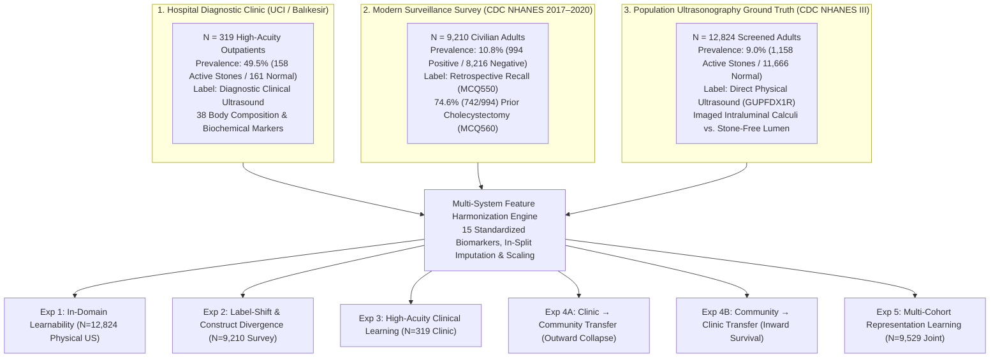

# 🩺 Predicting Ultrasound-Detected Gallstones from Non-Imaging Clinical Data
### Cross-Cohort Generalization and Reference-Standard Validation

[](https://www.python.org/downloads/)
[](https://pytorch.org/)
[](LICENSE)
[](https://www.tripod-statement.org/)
[](PAPER.pdf)

An open, reproducible machine learning benchmark investigating whether routinely collected non-imaging clinical biomarkers can detect active gallbladder stone disease (cholelithiasis), and how well models survive distribution shifts across populations, clinical acuity levels, and label-generating mechanisms.

---

## 🎯 Central Research Question & Tri-Cohort Paradigm

Clinical machine learning algorithms frequently optimize predictive metrics within isolated hospital registries, obscuring whether they learn invariant biological pathophysiology or capitalize on dataset-specific healthcare encounter patterns and administrative artifacts. 

Gallbladder stone disease presents a unique opportunity to evaluate label fidelity and domain transfer: while population health surveys capture retrospective questionnaire recall, direct transabdominal ultrasonography provides an operator-verified physical reference standard.

This benchmark evaluates models across **$N = 22,353$ patients** spanning three distinct epidemiological regimes:



---

## 🔬 Key Empirical Discoveries

### 1. The "Silent Gallstone Paradox"
By cross-tabulating physical transabdominal ultrasonography (`GUPFDX1R`) against in-person questionnaire recall (`HAJ9` / `HAJ12`) across $13,694$ NHANES III examination records:
- **$88.5\%$ of active ultrasound-confirmed gallstone cases ($1,025 / 1,158$) had NEVER received a diagnosis from a physician** (`HAJ9 == 2`). Only **$9.4\%$ ($109 / 1,158$)** reported awareness of having stones.
- Conversely, among participants who reported a history of gallstones, **$91.7\%$ ($798 / 870$) had already undergone surgical cholecystectomy**, possessing no gallbladder at examination.
- *Scientific Conclusion*: Retrospective survey recall labels model **healthcare access and post-surgical history**, not active biological lithogenesis. Evaluating non-imaging AI requires direct imaging ground truth.

### 2. In-Domain Physical Ultrasound Benchmark ($N = 12,824$)
Evaluating models against direct transabdominal ultrasonography confirms that routinely measured non-imaging blood and anthropometric biomarkers retain genuine, reproducible predictive signal:
- **PyTorch GallstoneNet**: **AUROC 0.758** [95% CI 0.726–0.791], Sensitivity **0.711** [0.646–0.776], Specificity 0.641 [0.618–0.664], Brier 0.187, Logistic Calibration Slope **1.05**, Intercept -2.15.
- **Soft Voting Ensemble**: **AUROC 0.757** [95% CI 0.724–0.790], Brier 0.149, Calibration Slope 1.23.
- Paired bootstrap testing revealed no statistically significant discriminative difference between GallstoneNet and the Soft Voting Ensemble ($\Delta\text{AUROC} = -0.0051$ [95% CI -0.0217 to 0.0119], $p = 0.538$).

### 3. Directional Transportability Asymmetry
Zero-shot bidirectional transfer across the 15 harmonized features revealed striking directional divergence:
- **Hospital Clinic $\to$ Community Screening Collapses Outward (Exp 4A)**: Models trained on narrow, high-acuity hospital outpatients collapsed to near-chance discrimination when screening unselected community participants (AUROC **0.525** [0.507–0.542], calibration slope 0.064). Hospital-trained models over-indexed on acute inflammatory and enzyme elevations.
- **Community Screening $\to$ Hospital Clinic Survives Inward (Exp 4B)**: In contrast, models trained on broad population physical ultrasound preserved statistically significant discriminative ordering when transferred zero-shot to the foreign hospital clinic (GallstoneNet **AUROC 0.635** [0.576–0.699], sensitivity **0.715** [0.646–0.787], calibration slope **0.57**, intercept **-0.04**).

---

## 📊 Summary Benchmark Performance

*All metrics report point estimate with 95% bootstrap confidence intervals from 1,000 non-parametric resamples; paired bootstrap resampling was used for model-to-model AUROC comparisons.*

| Experiment & Regime | Cohort & Features | Best Model | AUROC [95% CI] | Sensitivity | Specificity | Brier Score | Calib. Slope |
|:---|:---|:---|:---:|:---:|:---:|:---:|:---:|
| **Exp 1: Population US Ground Truth** | NHANES III ($N=12,824$, 15 feats) | GallstoneNet | **0.758** [0.726–0.791] | 0.711 | 0.641 | 0.187 | **1.05** |
| | | Soft Voting Ensemble | 0.757 [0.724–0.790] | 0.538 | 0.780 | 0.149 | 1.23 |
| | | XGBoost | 0.749 [0.715–0.782] | 0.630 | 0.716 | 0.176 | 0.91 |
| **Exp 2: Modern Survey Recall** | NHANES 2017–20 ($N=9,210$, 28 feats)| GallstoneNet | **0.772** [0.737–0.806] | 0.725 | 0.640 | 0.194 | 1.31 |
| | | Soft Voting Ensemble | 0.771 [0.736–0.809] | 0.450 | 0.879 | 0.133 | 1.39 |
| **Exp 3: Tertiary Hospital Clinic** | Balıkesir Clinic ($N=319$, 38 feats) | XGBoost | **0.896** [0.789–0.980] | 0.833 | 0.875 | 0.123 | 0.88 |
| | | GallstoneNet | 0.828 [0.696–0.937] | 0.667 | 0.792 | 0.175 | 0.76 |
| **Exp 4A: Clinic $\to$ Population US** | Train Clinic $\to$ Test US | Random Forest | 0.595 [0.578–0.611] | 0.391 | 0.734 | 0.218 | 0.64 |
| | | GallstoneNet | 0.525 [0.507–0.542] | 0.356 | 0.688 | 0.214 | 0.06 |
| **Exp 4B: Population US $\to$ Clinic** | Train US $\to$ Test Clinic | GallstoneNet | **0.635** [0.576–0.699] | 0.715 | 0.497 | 0.241 | **0.57** |
| | | Soft Voting Ensemble | 0.620 [0.560–0.684] | 0.418 | 0.733 | 0.249 | 0.62 |
| **Exp 5: Multi-Cohort Harmonized** | Pooled UCI + NHANES ($N=9,529$) | GallstoneNet | **0.716** [0.675–0.754] | 0.705 | 0.627 | 0.216 | **0.96** |
| | | Soft Voting Ensemble | 0.716 [0.677–0.754] | 0.410 | 0.848 | 0.154 | 1.18 |

---

## 📁 Repository Structure

```text
gallstone-ml/
├── README.md                          # Comprehensive project documentation
├── LICENSE                            # MIT License
├── CITATION.cff                       # Citation metadata
├── requirements.txt                   # Verified dependencies
├── .gitignore                         # Security & data-exclusion rules
│
├── configs/                           # Central configuration
│   ├── __init__.py
│   └── default.py                     # Feature sets, hyperparameters, and seeds
│
├── data/                              # Data documentation & directory stub
│   ├── README.md                      # Data provenance, URLs, and acquisition guide
│   └── .gitkeep
│
├── models/                            # Checkpoints & benchmark JSON artifacts
│   ├── README.md                      # Model zoo documentation
│   ├── best_model.pt                  # Pretrained PyTorch checkpoint
│   ├── exp_a_uci_clinic_gallstonenet.pt
│   ├── exp_b_nhanes_full_gallstonenet.pt
│   ├── exp_c_cross_external_gallstonenet.pt
│   ├── exp_d_joint_harmonized_gallstonenet.pt
│   ├── ultrasound_benchmarks.json     # Exp 1, 4A, 4B benchmark metrics & 95% CIs
│   ├── multi_cohort_benchmarks.json   # Exp A, B, C, D metrics
│   ├── additional_benchmarks.json     # Subgroup, sensitivity, and ablation metrics
│   └── paper_scientific_tables.json   # Baseline characteristics & missingness
│
├── plots/                             # Publication-grade figures & curves
│   ├── calibration_curves_5panel.png
│   ├── roc_pr_curves_combined.png
│   ├── decision_curve_analysis.png
│   ├── feature_importance_nhanes.png
│   └── ultrasound_benchmark_summary.png
│
├── scripts/                           # Top-level execution entrypoints
│   ├── run_benchmarks.py              # Executes benchmark pipelines
│   └── run_analyses.py                # Computes statistical tables and figures
│
└── src/                               # Modular scientific source code
    ├── __init__.py
    ├── dataset.py                     # UCI dataset loading & leak-free preprocessing
    ├── harmonized_dataset.py          # Harmonization engine & in-split imputation/scaling
    ├── prepare_nhanes.py              # Modern NHANES XPT merger
    ├── prepare_nhanes3.py             # NHANES III raw fixed-width extractor
    ├── download_nhanes.py             # Download utility
    ├── model.py                       # PyTorch GallstoneNet architecture
    ├── train.py                       # Baseline PyTorch trainer
    ├── train_all.py                   # Multi-cohort benchmark execution engine
    ├── benchmark_ultrasound.py        # Ultrasound benchmark execution engine
    ├── compute_all_scientific_analyses.py # Table 1 & missingness generator
    ├── compute_exact_lrt_and_boot.py  # Likelihood ratio test & paired bootstrap
    ├── compute_models_and_figures.py  # Subgroups, sensitivity, ablations & DCA
    └── predict.py                     # Research inference CLI
```

---

## ⚙️ Installation & Clean Environment Setup

### 1. Clone the Repository
```bash
git clone https://github.com/ayushshuklaivyleague-jpg/Gallstone-research-.git
cd Gallstone-research-
```

### 2. Set Up a Clean Virtual Environment
```bash
# Using standard Python (v3.10 to v3.13 supported)
python -m venv .venv

# On Linux / macOS:
source .venv/bin/activate

# On Windows (PowerShell):
.\.venv\Scripts\Activate.ps1
```

### 3. Install Dependencies

You can choose either flexible dependency ranges or exact bit-for-bit pinned packages:

```bash
# Option A: Standard flexible dependencies (Python 3.10 to 3.13):
pip install --upgrade pip
pip install -r requirements.txt

# Option B: Bit-for-bit identical scientific reproducibility (Exact lockfile):
pip install -r requirements-lock.txt

# Option C: Conda / Mamba environment:
conda env create -f environment.yml
conda activate gallstone-ml
```

---

## 📥 Data Acquisition

Raw patient-level datasets are subject to institutional data governance and are **not hosted directly in git**. All datasets are free, publicly accessible, and legally obtainable for secondary research:

1. **UCI Hospital Clinic Dataset ($N = 319$)**: Download from the [UCI Machine Learning Repository](https://archive.ics.uci.edu/dataset/892/cholelithiasis+prediction+dataset) and place at `data/gallstone_.csv`.
2. **CDC NHANES III Physical Ultrasound ($N = 12,824$)**: Download `exam.dat`, `lab.dat`, and `adult.dat` from the [CDC NCHS portal](https://wwwn.cdc.gov/nchs/nhanes/nhanes3/default.aspx) into `data/nhanes3/`, then run:
   ```bash
   python -m src.prepare_nhanes3
   ```
3. **CDC Continuous NHANES 2017–2020 ($N = 9,210$)**: Download SAS `.XPT` files into `data/nhanes/`, then run:
   ```bash
   python -m src.prepare_nhanes
   ```

*See [data/README.md](data/README.md) for detailed direct FTP/HTTPS download URLs and checksums.*

---

## 🚀 Running Benchmarks and Reproducing Experiments

### 🏆 Master Scientific Reproduction (Single Canonical Command)
To regenerate every benchmark, statistical test, baseline table, publication figure, and compiled manuscript PDF from a single unified pipeline:

```bash
python scripts/reproduce_all.py --all
```

Or execute modular stages individually:
```bash
python scripts/reproduce_all.py --tables      # Baseline characteristics & missingness
python scripts/reproduce_all.py --stats       # Nested LRT deviance & paired bootstrap tests
python scripts/reproduce_all.py --figures     # Calibration curves, ROC/PR, & DCA plots
python scripts/reproduce_all.py --benchmark   # Canonical ultrasound benchmark suite
python scripts/reproduce_all.py --cv          # Repeated Stratified 5-Fold Cross-Validation
python scripts/reproduce_all.py --paper       # Compile publication PDF and HTML
```

### 1. Run Physical Ultrasound Ground-Truth Benchmark (Exp 1 & Exp 4)
```bash
# Standard 70/15/15 single-split benchmark (train, validation recalibration, held-out test):
python scripts/run_benchmarks.py --ultrasound

# Optional: Execute repeated Stratified 5-Fold Cross-Validation on development cohort:
python scripts/run_benchmarks.py --ultrasound --cv --folds 5
```
This trains GallstoneNet, XGBoost, LightGBM, Random Forest, and the **Soft Voting Super Ensemble** (0.35/0.35/0.15/0.15 blend with validation-locked Platt probability recalibration), computes 1,000 non-parametric bootstrap resamples (with paired bootstrap resampling for pairwise model comparisons), evaluates calibration slopes/intercepts across the Cox-Steyerberg hierarchy, and measures bidirectional cross-cohort transfer with the hospital clinic.

### 2. Run Multi-Cohort Benchmark Suite (Exp A, B, C, D)
```bash
python scripts/run_benchmarks.py --multi-cohort
```

### 3. Run Statistical Analyses, Likelihood Ratio Tests & Figures
```bash
python scripts/run_analyses.py --all
```
This computes:
- Exact participant flow and Table 1 baseline characteristics with Standardized Mean Differences (SMD);
- Table 2 missingness profile across cohorts;
- Formal Likelihood Ratio Tests ($\chi^2$ deviance) comparing nested demographic and laboratory models;
- Paired non-parametric bootstrap differences in AUROC with dynamic empirical $p$-values and 95% confidence intervals;
- Subgroup performance (Age, Sex, BMI) and sensitivity ablations (dropping CRP, liver enzymes, core-only panel);
- Decision Curve Analysis (DCA net clinical benefit curves);
- Complex survey design note: individual-level empirical risk minimization vs survey-weighted prevalence.

---

## 🔬 Research Inference CLI

The repository includes an interactive command-line interface for research inference and benchmark demonstration across individual patient profiles:

```bash
# Run demonstration on research case profiles:
python -m src.predict --model nhanes
python -m src.predict --model joint
python -m src.predict --model uci

# Launch interactive patient data entry mode:
python -m src.predict --interactive --model joint
```

Example Output:
```text
==================================================================
🩺 GALLSTONE AI PREDICTION SYSTEM [JOINT PRESET]
==================================================================
✅ Loaded: exp_d_joint_harmonized_gallstonenet.pt
📊 Active Biomarkers: 20 features

▶ Patient 1: Symptomatic Female with RUQ Pain & Elevated BMI
   ┌────────────────────────────────────────────────────────┐
   │  Prediction:    GALLSTONE DETECTED                     │
   │  Probability:   67.6%                                   │
   │  Risk Tier:     HIGH RISK 🟠                            │
   │  Action:        Abdominal ultrasound recommended.      │
   └────────────────────────────────────────────────────────┘
```

> **Clinical Disclaimer**: This software is intended solely for retrospective research benchmarking and methodological evaluation. It does not constitute a validated diagnostic device and must not be used for primary clinical diagnosis or individual patient management without prospective clinical trial validation.

---

## ⚖️ Ethics, Governance, and Authorship

- **Data Governance**: All analyses represent secondary research conducted on publicly available, de-identified datasets (CDC NHANES and UCI ML Repository). Under 45 CFR 46.104(d)(4), this study does not involve primary human subjects and is exempt from formal institutional review board (IRB) review.
- **Reporting Guidelines**: Study design, model evaluation, and reporting were informed by the TRIPOD+AI and PROBAST+AI guidelines.
- **Authorship**: Conducted by Ayush Shukla (Independent Researcher). Contributions, datasets, and methods are fully reported without omission or synthetic claims.

---

## 📜 Citation

If you use this benchmark, methodology, or code in your research, please cite:

```bibtex
@article{shukla2026gallstone,
  title={Predicting Ultrasound-Detected Gallstones from Non-Imaging Clinical Data: Cross-Cohort Generalization and Reference-Standard Validation},
  author={Shukla, Ayush},
  journal={arXiv preprint},
  year={2026},
  url={https://github.com/ayushshuklaivyleague-jpg/Gallstone-research-}
}
```

---

## 📄 License

This repository is distributed under the terms of the [MIT License](LICENSE).
